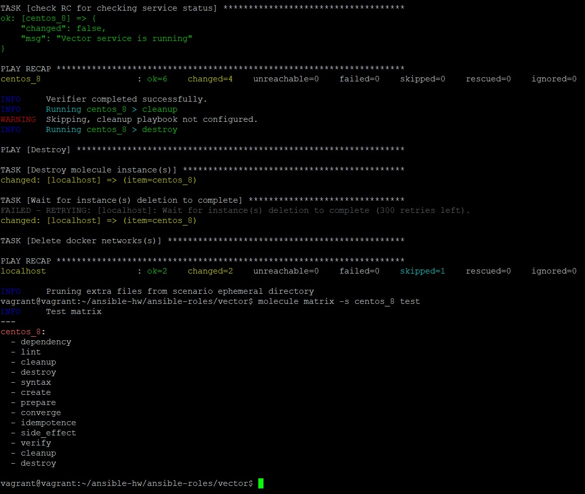
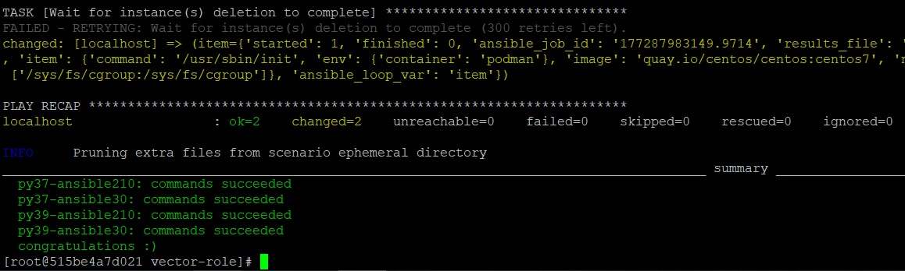

_[Ссылка](https://github.com/netology-code/mnt-homeworks/tree/MNT-13/08-ansible-05-testing) на задания_

[Репозиторий](https://github.com/Dracula33/ansible-vector) с ролью Vector

### Задание по Molecule

Сделано 3 сценария тестирования на разных операционных системах
* centos_7
* centos_8
* ubuntu_2204

На скрине ниже есть результат выполнения сценария для OS centos 8  
Конкретно, на скрин попала вторая проверка из этапа verify, а также cleanup и destroy перед завершением теста. Также есть вывод матрицы этапов проверки для этого сценария  
Команда запуска - `molecule test -s centos_8`



В репозиторий с ролью добавлен тег [0.1.0](https://github.com/Dracula33/ansible-vector/releases/tag/0.1.0)

---

### Задание по Tox

В качестве облегченного сценария для tox использовал default  
Оставил в нем только следующие этапы:
```yaml
scenario:
  test_sequence:
    - dependency
    - create
    - prepare
    - converge
    - destroy
```

Чтобы тест заработал, пришлось в контейнере в файле `/etc/containers/containers.conf`
поменять значение utsns на private (`utsns="private"`)

Результат запуска на скрине ниже



В репозиторий с ролью добавлен тег [0.2.0](https://github.com/Dracula33/ansible-vector/releases/tag/0.2.0)

---