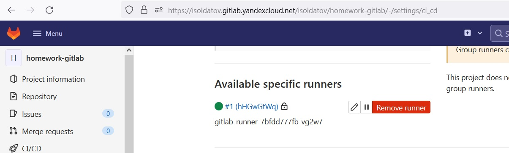
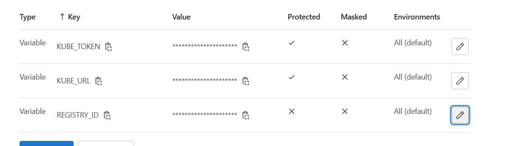
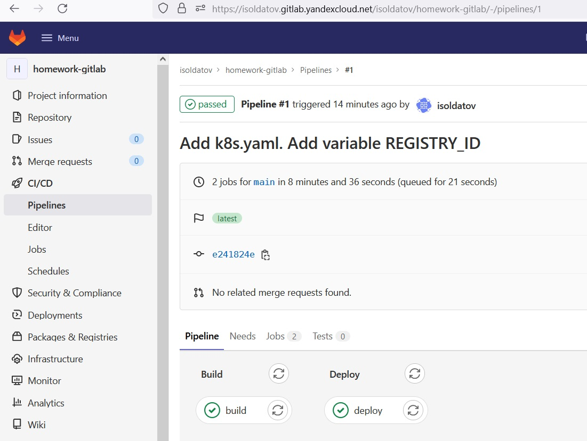
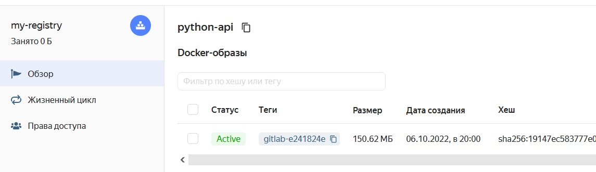
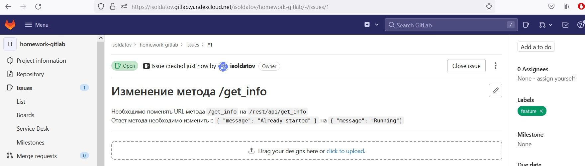
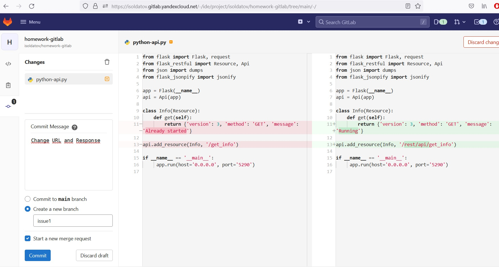
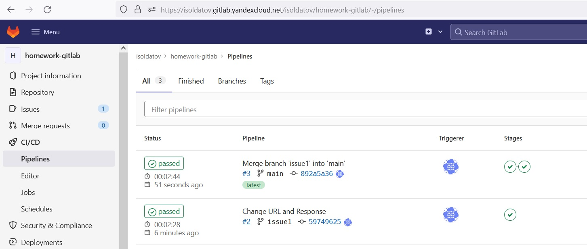
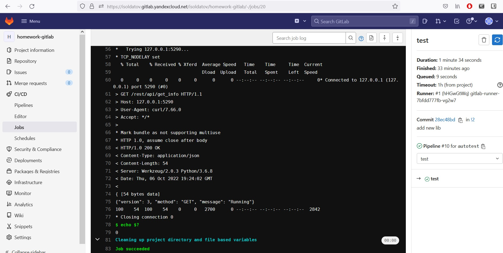
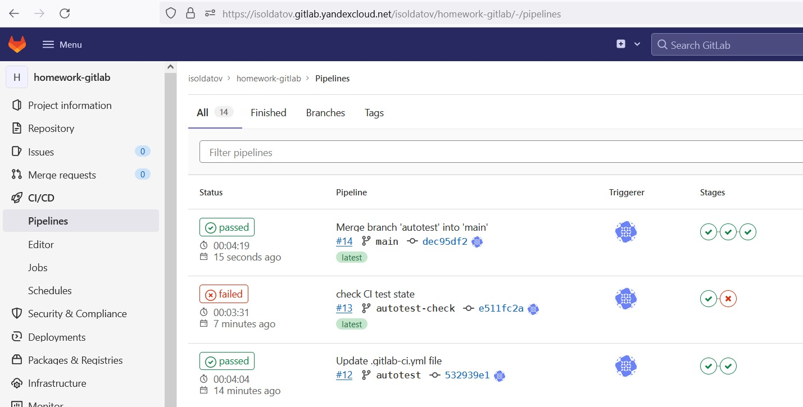
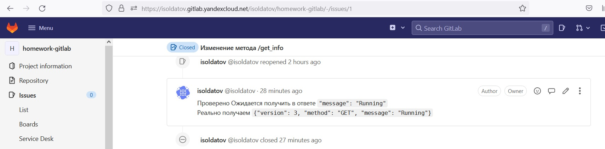

_[Ссылка](https://github.com/netology-code/mnt-homeworks/tree/MNT-13/09-ci-06-gitlab) на задания_

### Подготовка

Репозиторий в GitLab доступен по адресу https://isoldatov.gitlab.yandexcloud.net/isoldatov/homework-gitlab

Поднял GitLab и все остальное по инструкции.  
Подключил Runner  

Добавил переменные  

---
### DevOps часть

Сделал [Dockerfile](./gitlab-repo/Dockerfile) по сборке контейнера. Описал стейджи build и deploy сборки в [CI файле](./gitlab-repo/.gitlab-ci.yml)  

Проверил, что оно работает правильно. На main выполняются два стейджа

Проверил, что образ попадает в Container Registry  
  

---  
### Product Owner часть

Создал Issue, поставил зеленый label  

---
### Developer часть

Внес изменения в код, закоммитил в новую ветку, создал Merge request

Проверил, что на ветке `issue1` все собралось корректно.  
Принял Merge request.  
На main все также собралось и задеплоилось корректно

---
### Tester часть

Добавил в [CI](./gitlab-repo/.gitlab-ci.yml) stage `test`. После некоторых итераций в ветке `autotest` удалось получить результат от приложения  

Добавил его автоматическую обработку и выход с кодом 1, если подстроки Running в ответе не найдено.  
Проверил работу в ветке `autotest-check` (изменил ответ сервиса на другой в .py файле), сборка завалилась на стейдже `test`  
Смерджил изменения в `main`, отработало 3 стейджа  

Закрыл задачу с комментарием  

---