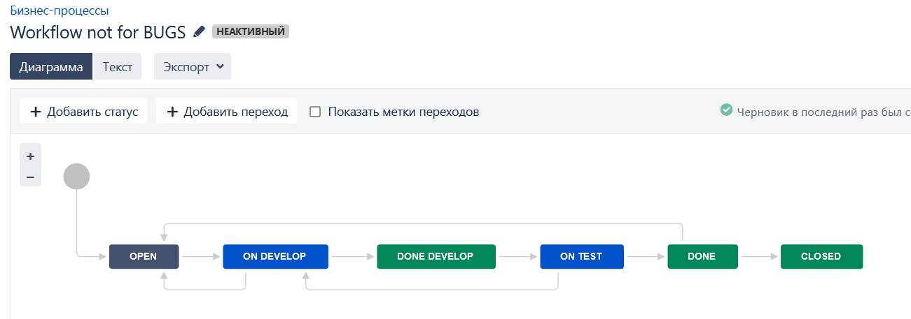

_[Ссылка](https://github.com/netology-code/mnt-homeworks/tree/MNT-13/09-ci-01-intro) на задания_

### Workflow для багов

[Ссылка](./attachment/Workflow_For_BUG.xml) на экспортированный файл в XML

---

### Workflow для всех остальных задач

[Ссылка](./attachment/Workflow_not_for_BUGS.xml) на экспортированный файл в XML

---

### Провел несколько задач по Workflow через Kanban

---

### Создал спринт

---

### Провел спринтовые задачи через Kanban и закрыл спринт. 

---
