_[Ссылка](https://github.com/netology-code/mnt-homeworks/tree/MNT-13/09-ci-04-jenkins) на задания_

### Задача 1

Создан джоб [molecule_start](./infrastructure/files/jenkins/jobs/molecule_start/config.xml)  

Запуск джоба  

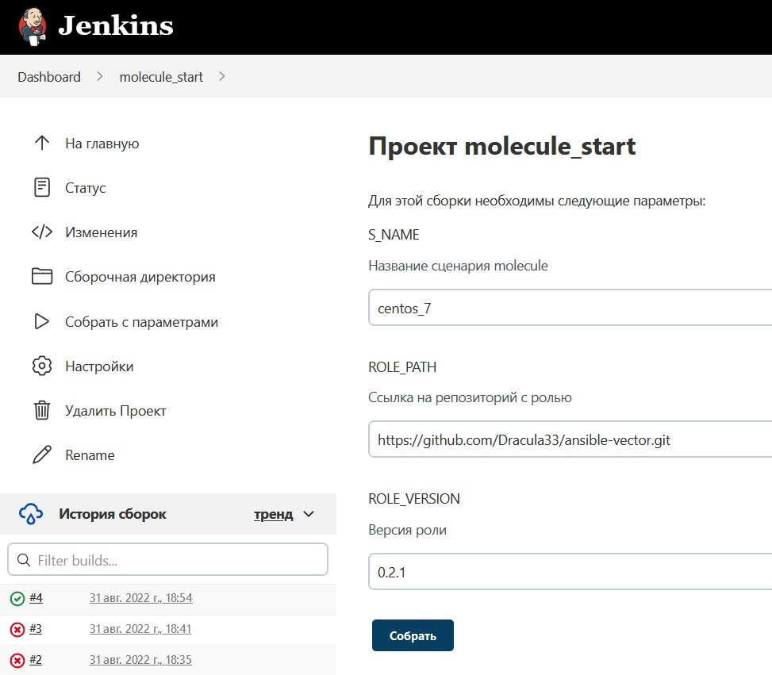

Результат выполнения джоба (запуск molecule)  

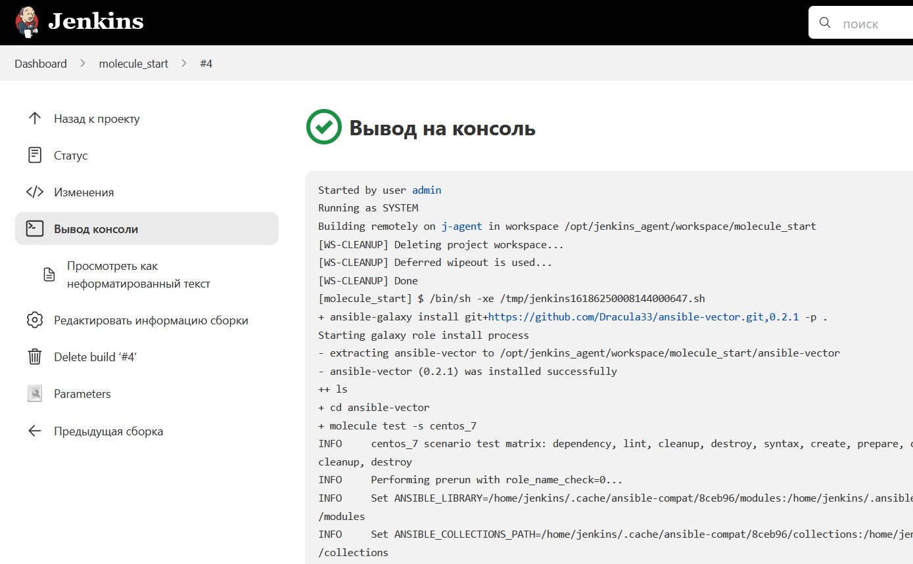

---

### Задача 2

Создан джоб [molecule_start_declarative](./infrastructure/files/jenkins/jobs/molecule_start_declarative/config.xml)

Запуск джоба

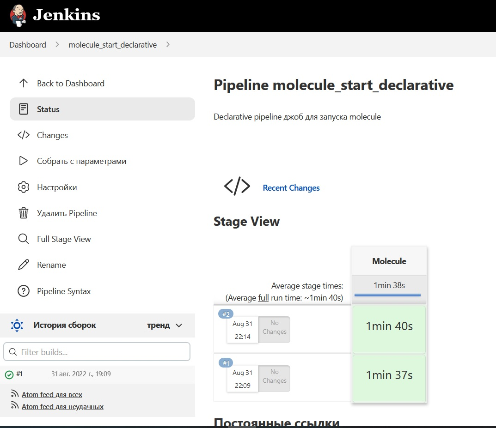

---

### Задача 3,4

На основе второго задания создан [Jenkinsfile](https://github.com/Dracula33/ansible-vector/blob/main/Jenkinsfile), помещен в репозиторий с ролью, созданной в предыдущих домашках

Создан джоб [molecule_start_multibranch](./infrastructure/files/jenkins/jobs/molecule_start_multibranch/config.xml) на основе репозитория с ролью

Запуск джоба  

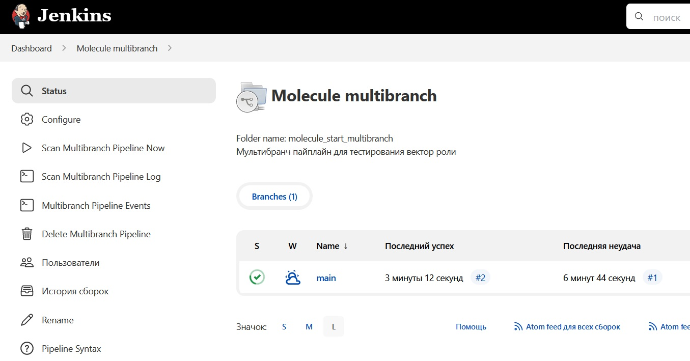

---

### Задачи 5,6,7

Создал Scripted Pipeline, внес изменения, сохранил в [ScriptedJenkinsfile](./ScriptedJenkinsfile)

Создан джоб [scripted_pipeline](./infrastructure/files/jenkins/jobs/scripted_pipeline/config.xml) по его проверке

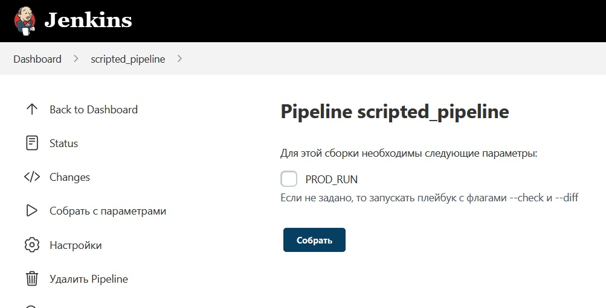

Результат запуска джоба без параметра PROD_RUN (проверка наличия флагов `--diff --check`)

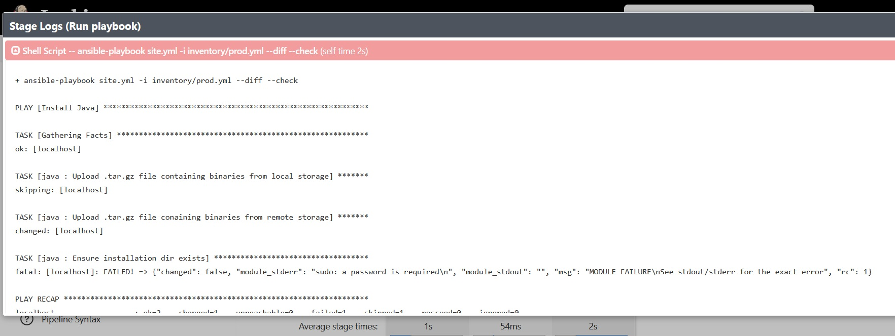

---

### Необязательная задача 1

Написал Groovy script [AllJobFailure.groovy](./AllJobFailure.groovy)

Исходные данные для запуска (в джобе scripted_pipeline есть ошибочные билды)

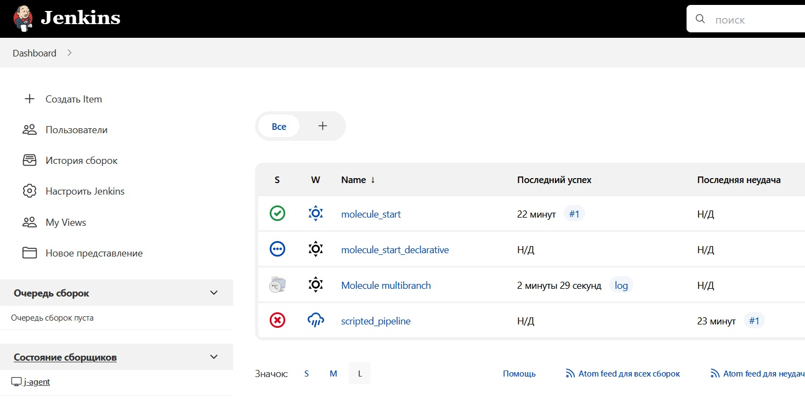

Результат запуска

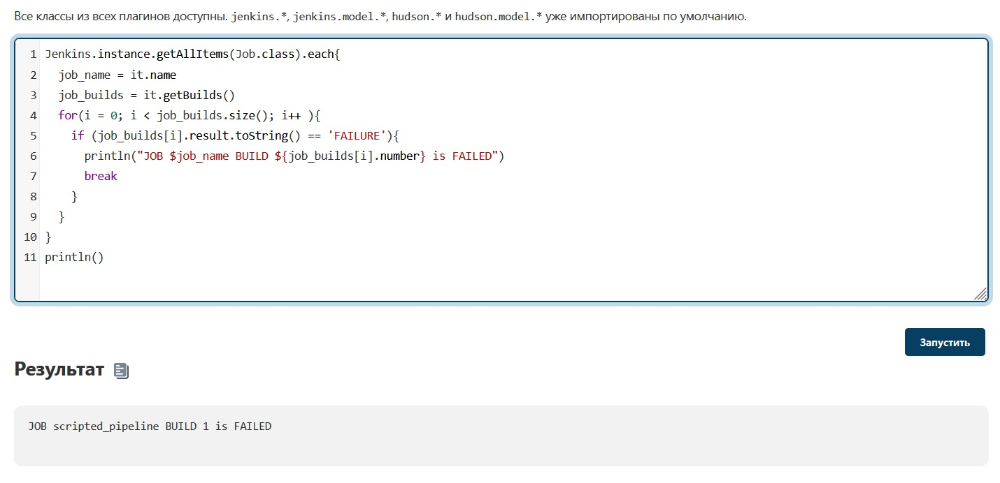

---

### Необязательная задача 2

Создан джоб [optional](./infrastructure/files/jenkins/jobs/optional/config.xml)

Сделал простой [плейбук](https://github.com/Dracula33/example-fro-jenkins/blob/main/site.yml) для запуска  
В [inventory](https://github.com/Dracula33/example-fro-jenkins/blob/main/inventory/test.yml) добавил пару хостов

Запуск джоба

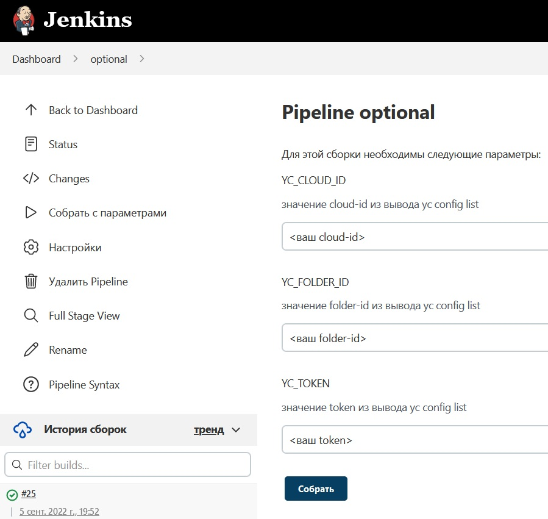

Код pipeline
```groovy
node {
    stage('Clone playbook') { 
        git branch: 'main', url: 'https://github.com/Dracula33/example-fro-jenkins.git'
    }
    stage('Get instance count') {
        host_list = sh (returnStdout: true, script: 'grep -n ansible_host ./inventory/*.yml')
        host_list_arr = host_list.split('\n')
    }
    stage('Create infrastructure') {
        yc_net_stdout = sh (returnStdout: true, script: '/home/jenkins/yandex-cloud/bin/yc vpc network create net_test --cloud-id $YC_CLOUD_ID --folder-id $YC_FOLDER_ID --token $YC_TOKEN --format json')
        g_net_id = new groovy.json.JsonSlurper().parseText(yc_net_stdout).id
        yc_subnet_stdout = sh (returnStdout: true, script: "/home/jenkins/yandex-cloud/bin/yc vpc subnet create subnet_test --network-id $g_net_id --range 192.168.101.0/24 --zone ru-central1-a  --cloud-id $YC_CLOUD_ID --folder-id $YC_FOLDER_ID --token $YC_TOKEN --format json")
        g_subnet_id = new groovy.json.JsonSlurper().parseText(yc_subnet_stdout).id
        for (i = 0; i < host_list_arr.size(); i++){
            node_name='instance' + i
            yc_instance_stdout = sh (returnStdout: true, script: "/home/jenkins/yandex-cloud/bin/yc compute instance create $node_name --zone ru-central1-a --hostname $node_name --create-boot-disk image-folder-id=standard-images,image-family=centos-7 --platform standard-v3 --cores 2 --memory 4 --core-fraction 20 --network-interface subnet-id=${g_subnet_id},nat-ip-version=ipv4 --ssh-key ~/.ssh/id_rsa.pub --preemptible  --cloud-id $YC_CLOUD_ID --folder-id $YC_FOLDER_ID --token $YC_TOKEN --format json")
            g_instance_ip = new groovy.json.JsonSlurper().parseText(yc_instance_stdout).network_interfaces[0].primary_v4_address.one_to_one_nat.address
            line_number=host_list_arr[i].substring(0, host_list_arr[i].indexOf(":"))
            sh "sed -i '$line_number s|ansible_host: .*\$|ansible_host: $g_instance_ip|' ./inventory/*.yml"
        }
    }
    stage('Sleep while infrastructure is creating') {
        sh 'sleep 30'
    }
    stage('Run playbook') {
        sh 'export ANSIBLE_HOST_KEY_CHECKING=false && ansible-playbook -i inventory/test.yml site.yml'
    }
}
```

Результат запуска

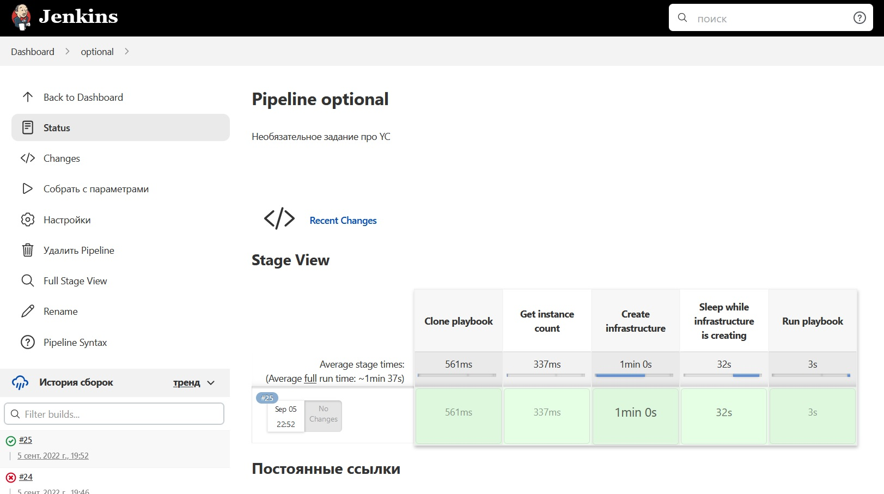

Конец лога stage по запуску playbook

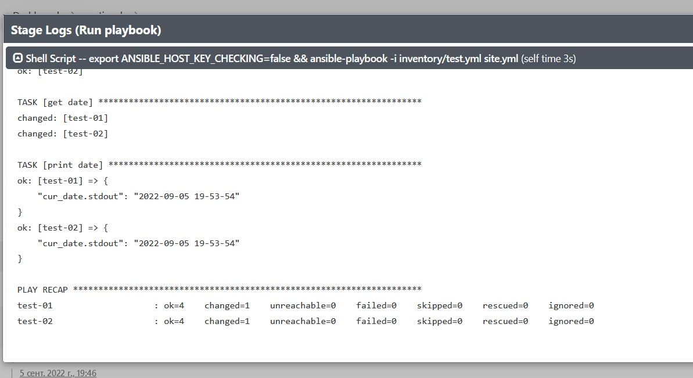

---
