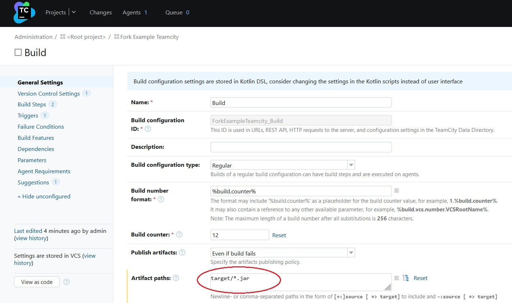

_[Ссылка](https://github.com/netology-code/mnt-homeworks/tree/MNT-13/09-ci-05-teamcity) на задания_

### Задача 1

Сделан [fork](https://github.com/Dracula33/fork-example-teamcity) от указанного репозитория

---

### Задача 4

Изменил конфигурацию сборки после автоопределения. Добавил еще 1 шаг

---

### Задача 7

Запустил сборку. Шаг Maven был пропущен, Deploy выполнился

Артефакт появился в Nexus

---

### Задача 8

Мигрировал [конфигурацию](https://github.com/Dracula33/fork-example-teamcity/tree/master/.teamcity) в репозиторий

---

### Задача 13

Внес изменения в класс, добавил метод и тест, поменял версию в `pom.xml`.  
Сборка по новой ветке прошла успешно. Выполнилось 6 тестов вместо 5 на `master`

---

### Задача 16

Настроил сбор jar файлов в артефакты сборки

---

### Задача 17

Проверил, что артефакты попадают в сборку

---