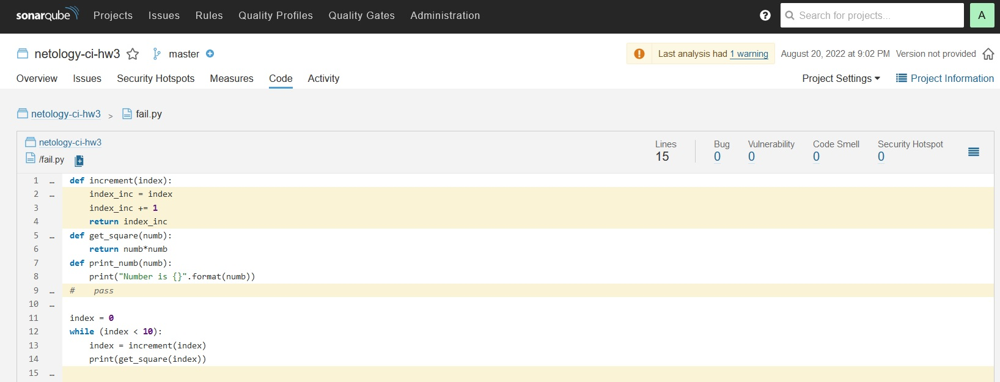
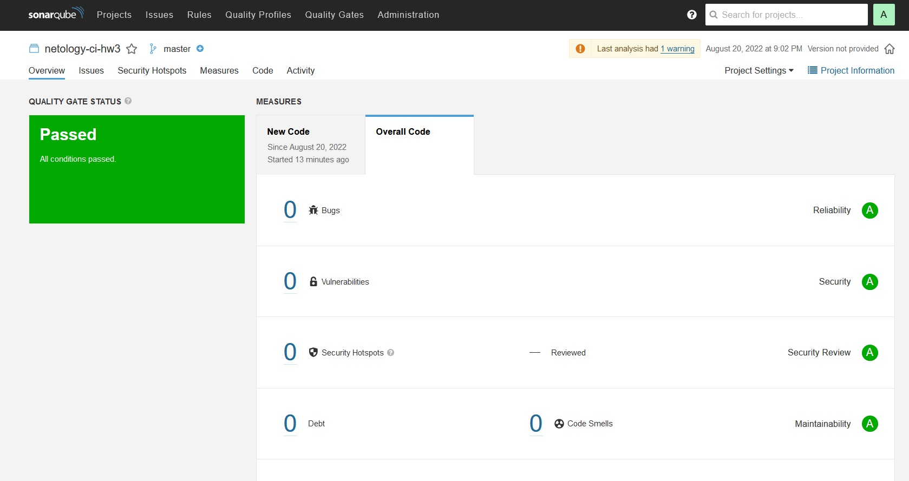
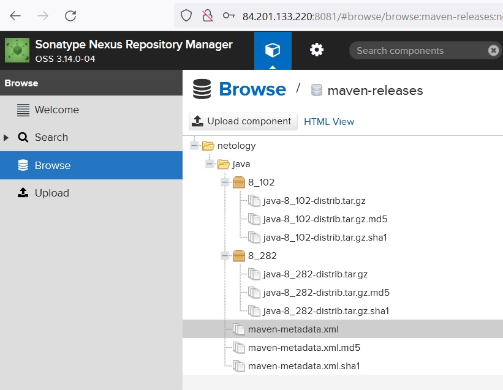
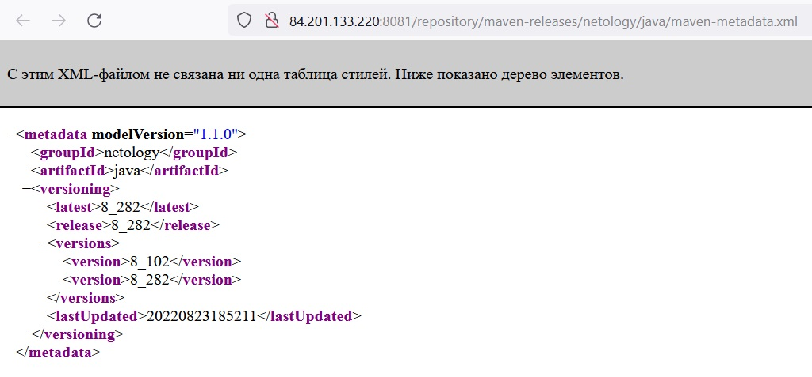
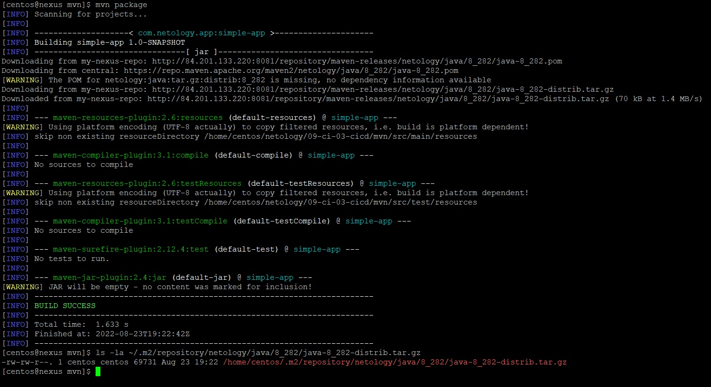
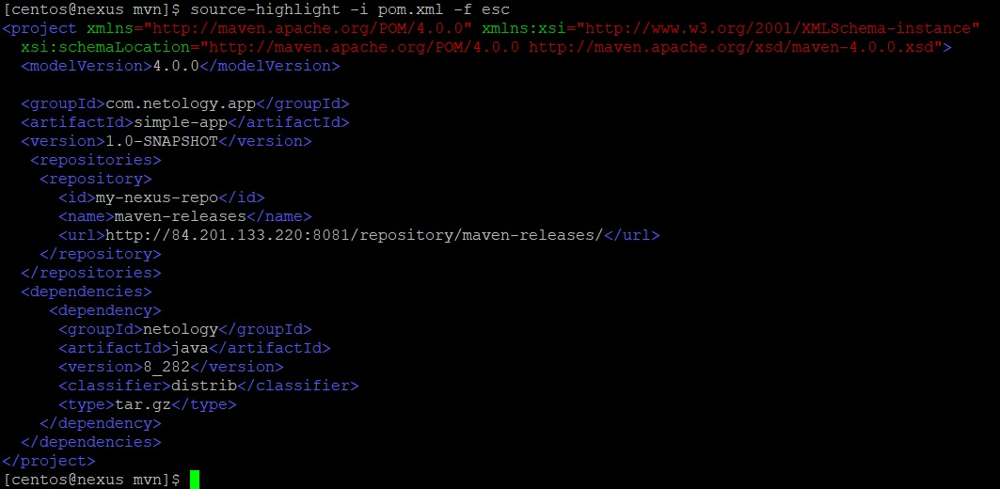

_[Ссылка](https://github.com/netology-code/mnt-homeworks/tree/MNT-13/09-ci-03-cicd) на задания_

### Задача по SonarCube

Исправленные ошибки в коде

Успешно пройденный анализ

---

### Задача по Nexus

Добавленные артефакты

файл [maven-metadata.xml](./attachment/maven-metadata.xml)

---

### Задача по Maven

Запуск команды `mvn package` и `ls -la` c артефактом в локальном репозитории

Исправленный [pom.xml](./attachment/pom.xml)

---