_[Ссылка](https://github.com/netology-code/clokub-homeworks/blob/clokub-5/15-2.md) на задания_

### Задание 1

1. Создадим [бакет](./terraform_host/backet.tf) и [объект](./terraform_host/bucket_object.tf) в нем

Бакет с одним объектом  
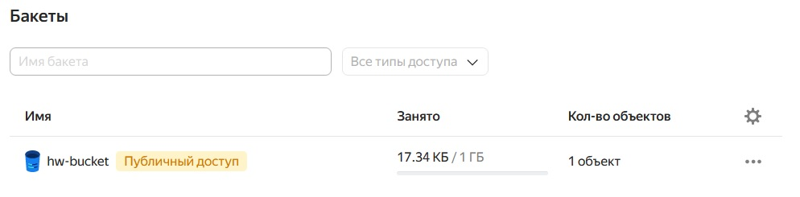

Объект-картинка лежит внутри  
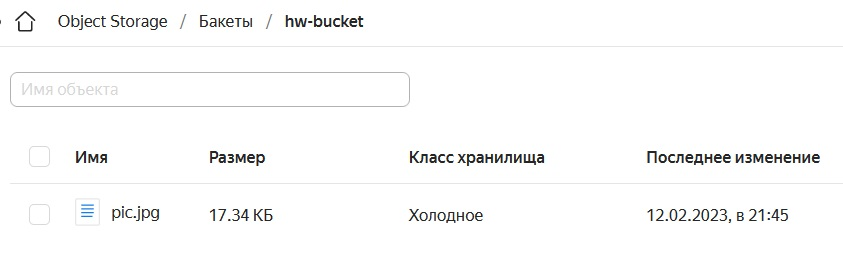

Проверим доступность. Информация об объекте отображается. Картинка открывается  
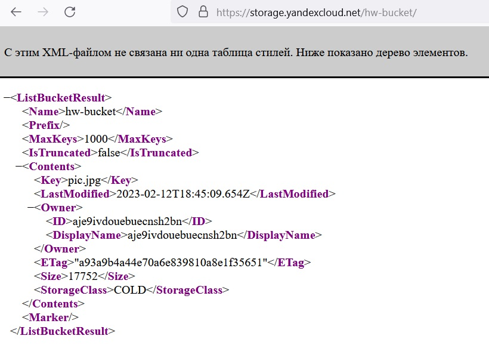

2. Создадим [группу ВМ](./terraform_host/instance_group.tf) со [стартовой страничкой](./terraform_host/cloud-init.yaml)

Группа  
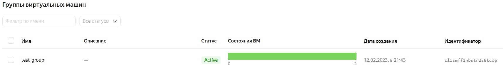

2 машины с образом LAMP  
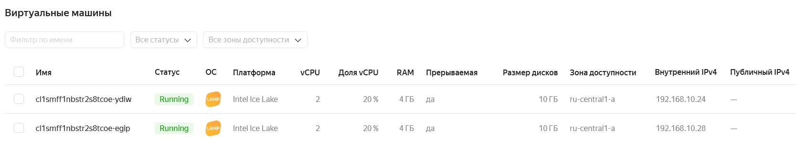

У группы настроена проверка состояния  
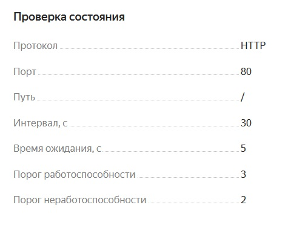

По "/" возвращается стартовая страница образа  
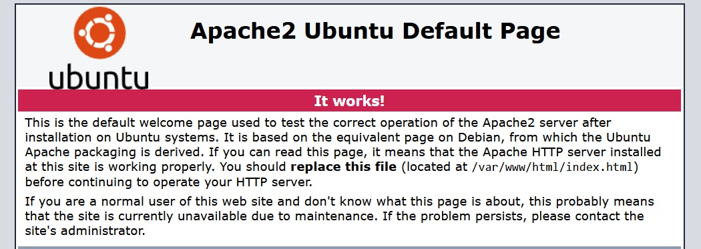

3. Создадим [сетевой балансировщик](./terraform_host/network_load_balancer.tf.bak)

Балансировщик  
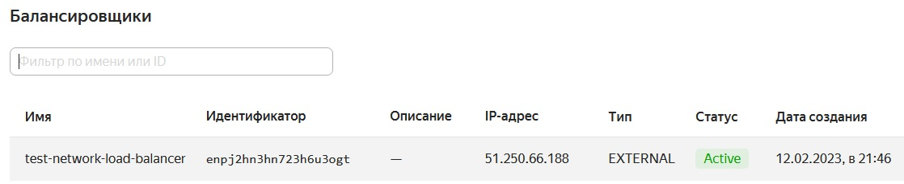

Целевая группа для балансировщика  
Для её создания необходимо использовать параметр _load_balancer_ при создании группы ВМ  
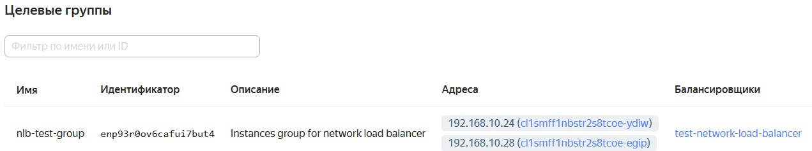

Проверим доступность объекта из бакета  
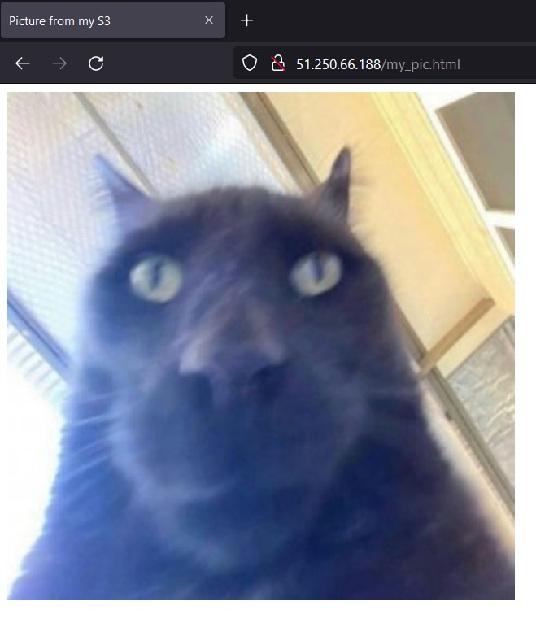

Остановим одну из ВМ и проверим доступность картинки  
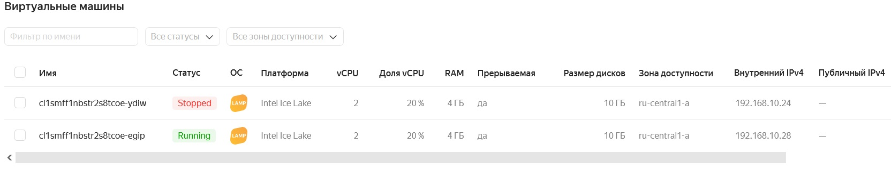

Политики группы ВМ через какое-то время подняли остановленный узел. Пока он лежал, картинка также открывалась  

4. Удалим сетевой балансировщик и настроим балансировщик уровня L7.  
Для этого создадим:

Целевую группу для балансировщика уровня L7  
Для её создания необходимо использовать параметр _application_load_balancer_ при создании группы ВМ  
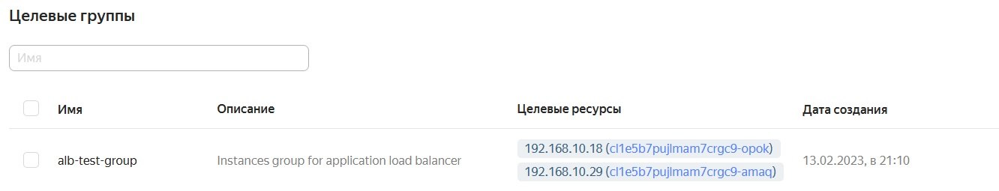

[Группу бэкендов](./terraform_host/application_backend_group.tf)  
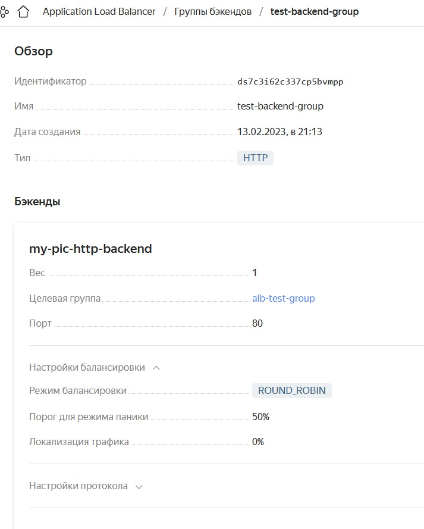

[Http-роутер](./terraform_host/application_http_router.tf) и виртуальный [хост](./terraform_host/application_virt_host.tf)  
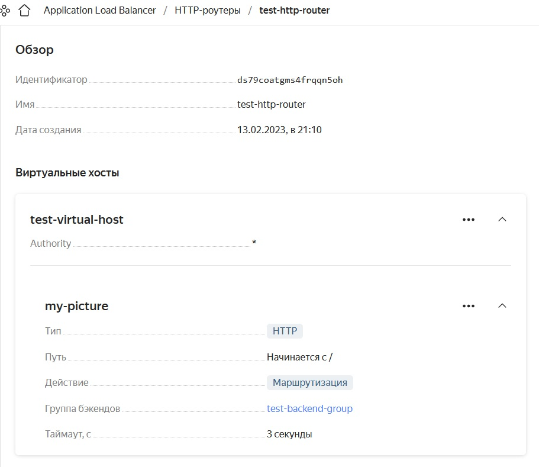

Сам [балансировщик](./terraform_host/application_load_balancer.tf)  
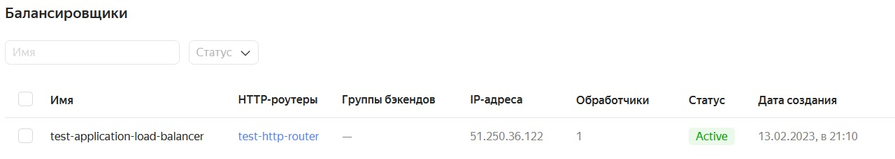

Проверим доступность страницы через IP балансировщика уровня L7  
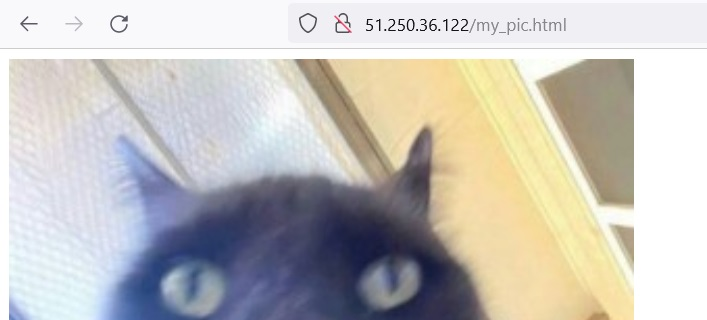

---