_[Ссылка](https://github.com/netology-code/clokub-homeworks/blob/clokub-5/15.4.md) на задания_

### Задание 1

1. Настроил [MySql кластер](./terraform_host/mysqlcluster.tf) по заданным условиям

Сам кластер  
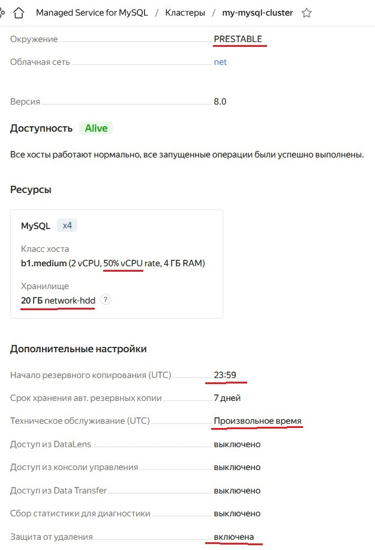

Его ноды с репликами в разных зонах доступности  
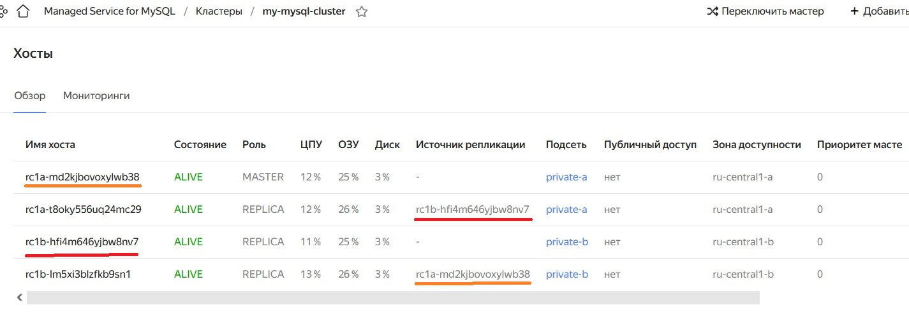

Топология кластера  
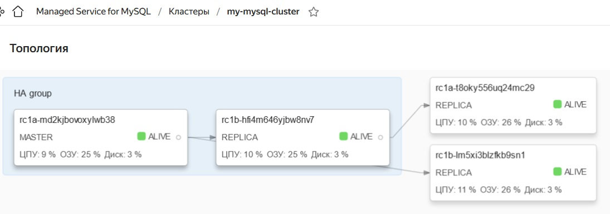

Создал [базу данных](./terraform_host/mysqldatabase.tf)  
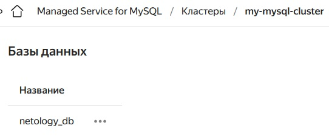

Создал [пользователя](./terraform_host/mysqluser.tf)  
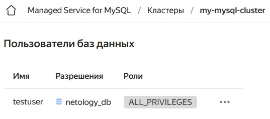

Так как все в приватной сети, создал [nat-instance](./terraform_host/nat-instance.tf.bak), с которого проверил доступ к БД  
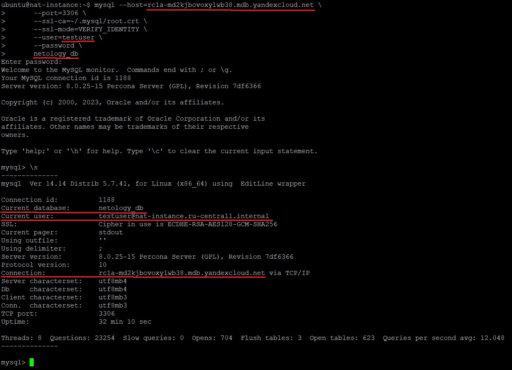

Сохранил параметры подключения в [ConfigMap](./terraform_host/db_configmap.tf) для последующих пунктов  

---

2. Настроил [кластер Kubernetes](./terraform_host/kubercluster.tf)

Создал для кластера [сервисный аккаунт](./terraform_host/kuberservice_accounts.tf), ключ [kms](./terraform_host/kms.tf)  
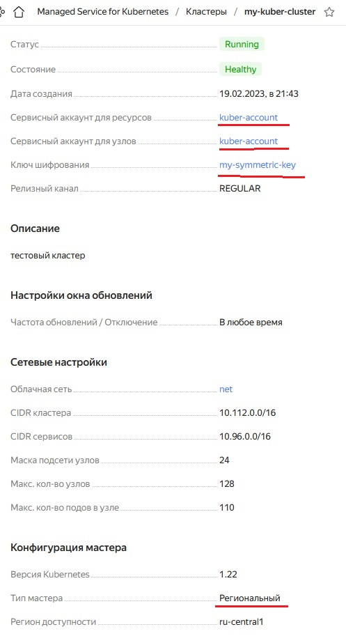

Создал [группу узлов](./terraform_host/kubercluster_group.tf) для кластера  
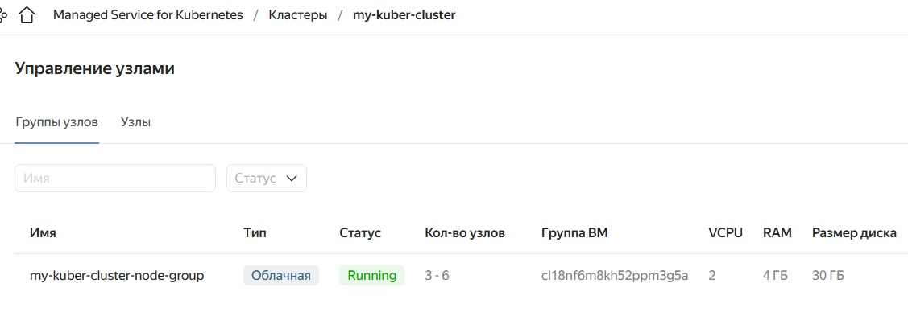

Группы с автомасштабированием создались только в одном регионе  
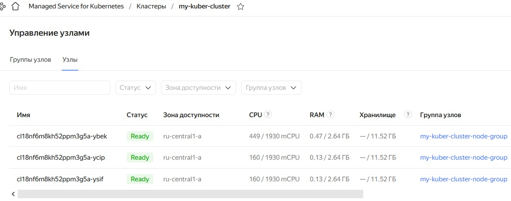

Пытался создать ноды в разных подсетях, похоже, для автомасштабирования это сделать нельзя  
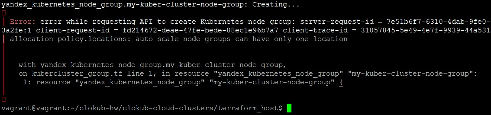

При помощи _yc_ получил конфиг для _kubectl_. Успешно подключился к кластеру  
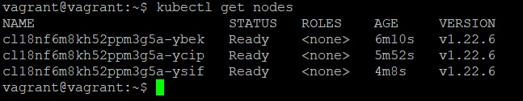

Задеплоил [phpmyadmin](./manifest/deployment.yaml). Проверил его через сервис с типом _NodePort_  
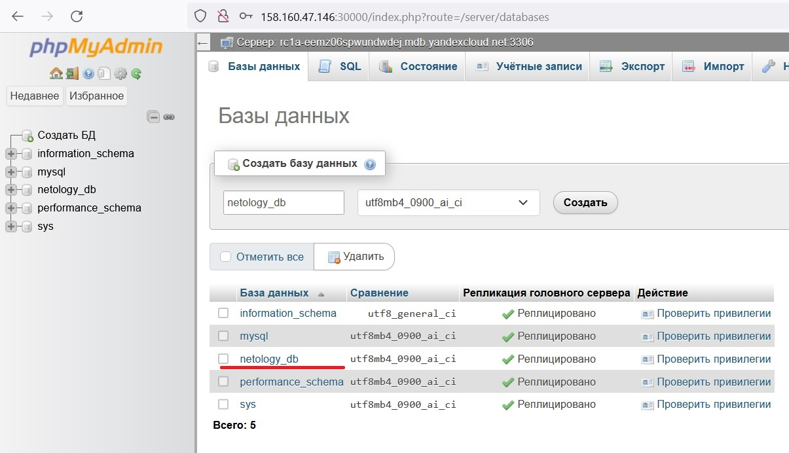

Задеплоил сервис с типом [LoadBalancer](./manifest/service.yaml). Появился балансировщик и целевая группа  
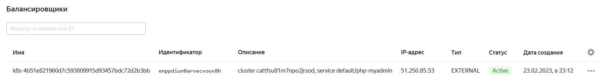

Подключился к БД через балансировщик  
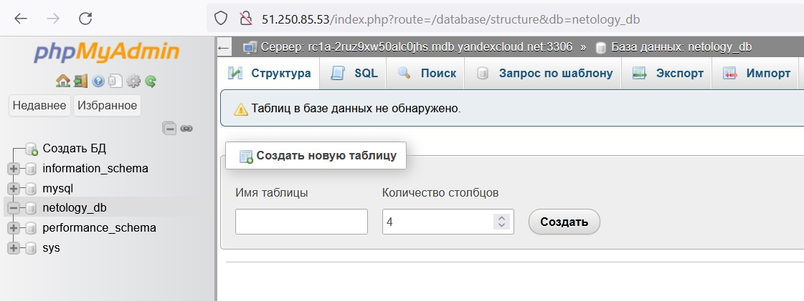

---