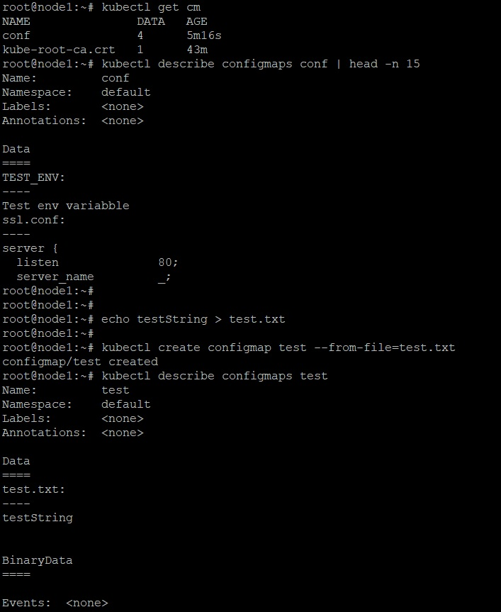

_[Ссылка](https://github.com/netology-code/clokub-homeworks/blob/clokub-5/14.3.md) на задания_

### Задание 1

- Задеплоил _ConfigMap_ из [манифеста](./ansible/files/manifests/configmap.yaml)  
- Получил список _ConfigMap_
- Получил описание своей карты конфигураций
- На основе файла создал еще одну карту
- Получил её описание

---

### Задание 2

Подключил ключи _ConfigMap_ в _Pod_ c _nginx_:
- в виде переменной окружения **TEST_ENV**
- в виде файлов с ssl сертификатами **tls.crt** и **tls.key**
- в виде настроечного файла nginx **ssl.conf**

Проверил, что переменная доступна, и nginx подхватил конфигурацию, сертификаты и доступен по https

---
