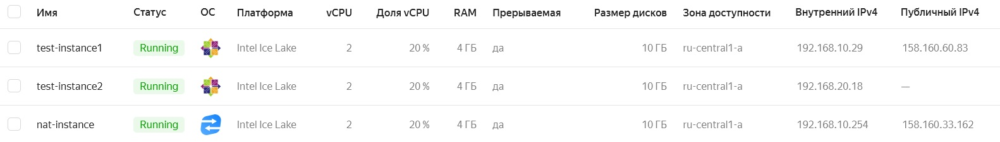
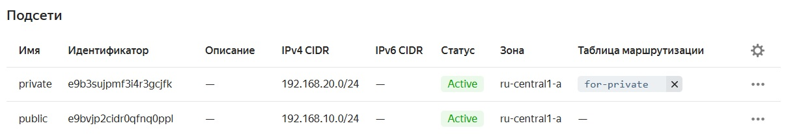
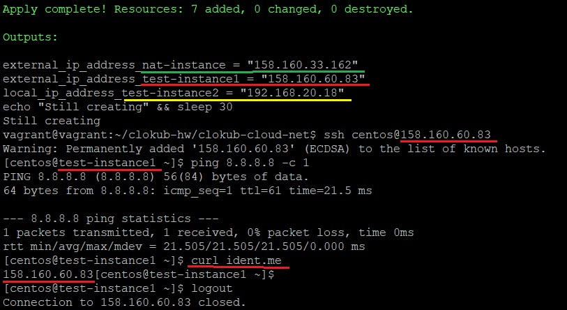
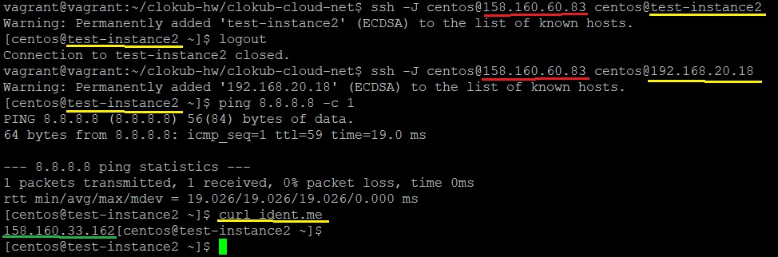

_[Ссылка](https://github.com/netology-code/clokub-homeworks/tree/clokub-5/15.1) на задания_

### Задание 1

Создал [объекты](./terraform_host) через terraform

Nat-инстанс, 2 тестовые виртуалки

public и private подсети с таблицей маршрутизации

Подключился к первой тестовой виртуалке  
Доступ к интернету есть. Трафик идет напрямую со своего внешнего адреса

Подключился ко второй тестовой виртуалке через первую в качестве _JumpHost_  
Доступ к интернету есть. Трафик идет с IP Nat-инстанса

---