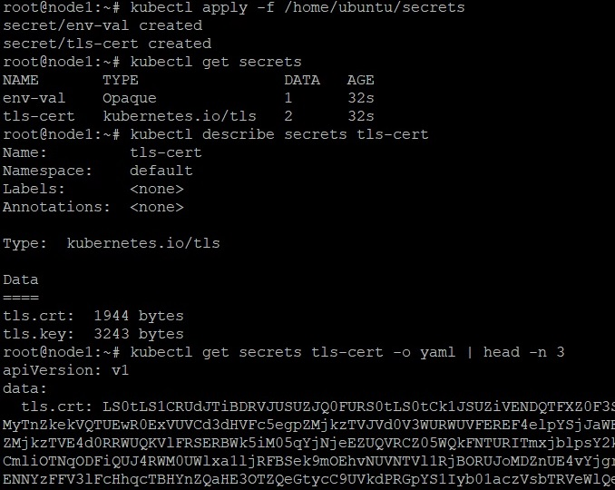
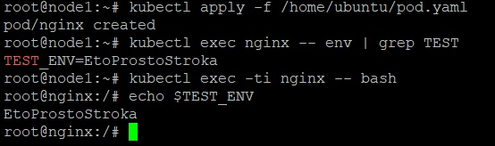
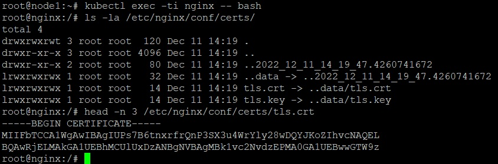
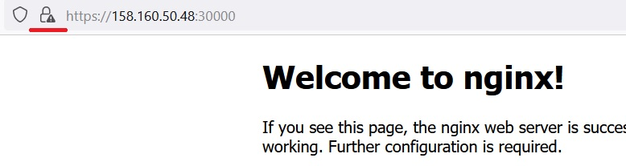

_[Ссылка](https://github.com/netology-code/clokub-homeworks/blob/clokub-5/14.1.md) на задания_

### Задание 1

Сгенерировал TLS сертификат и ключ. Поместил его в Secret с типом [tls](./ansible/files/manifests/secrets/secret-tls-cert.yaml)  
Создал [opaque](./ansible/files/manifests/secrets/secret-oraque.yaml) Secret со строкой
```yaml
---
apiVersion: v1
kind: Secret
metadata:
  name: env-val
type: Opaque
stringData:
  TEST_STRING: EtoProstoStroka
```

Задеплоил эти секреты. Выполнил несколько команд по работе с ними



---

### Задание 2

Написал [манифест](./ansible/files/manifests/pod.yaml) для пода с nginx, в котором использовал секреты
```yaml
    env:
    - name: TEST_ENV
      valueFrom:
        secretKeyRef:
          name: env-val
          key: TEST_STRING
    volumeMounts:
    - name: certs
      mountPath: "/etc/nginx/conf/certs"
      readOnly: true
    ...
      
  volumes:
  - name: certs
    secret:
      secretName: tls-cert
```

Первый был доступен через _env_. Вывел содержимое этой переменной среды для проверки 



Второй был доступен через файлы. Вывел содержимое одного из них



---

## Дополнительно 

Настроил nginx на использование секрета с ключем и сертификатом для SSL



Также в одной из предыдущих домашек использовал секрет [Dockerconfigjson](https://github.com/Dracula33/devops-netology/blob/main/homeworks/Kubernetes%20Kubectl/ansible/templates/manifests/secret_registry.yaml.j2) для доступа к Yandex Container Registry 

---

