_[Ссылка](https://github.com/netology-code/clokub-homeworks/blob/clokub-5/15.3.md) на задания_

### Задание 1

1. Создадим [ключ KMS](./terraform_host/kms.tf)

Сначала создалим все ресурсы без шифрования бакета  
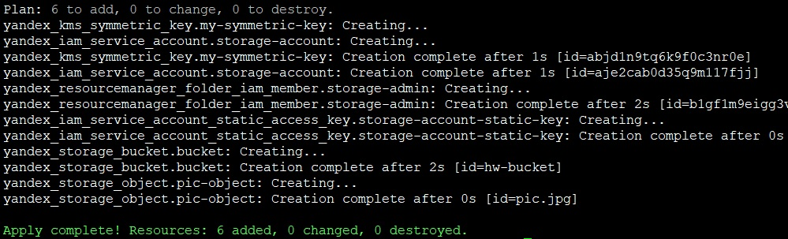

Ключ создался  
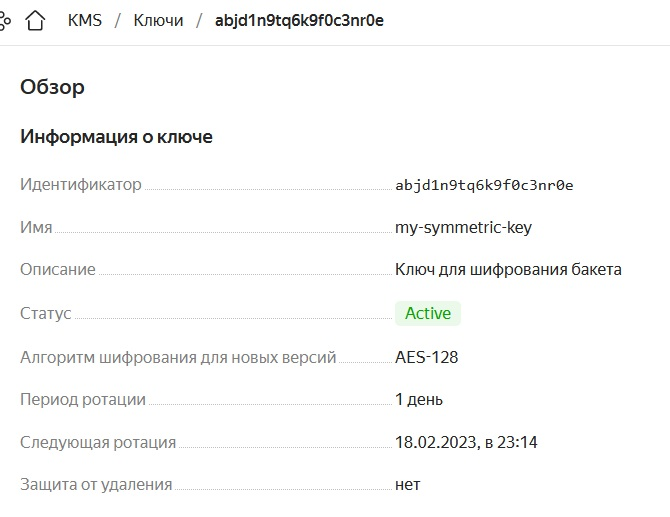

Потом изменим конфиг бакета, добавим _server_side_encryption_configuration_ для включения шифрования  
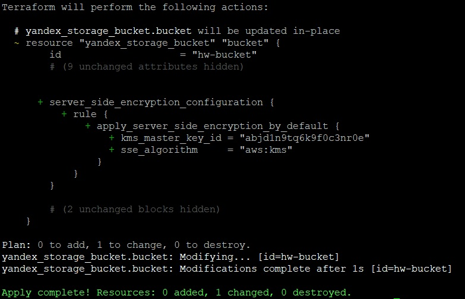

Если сразу создать бакет с шифрованием, то не получается положить в него объект    
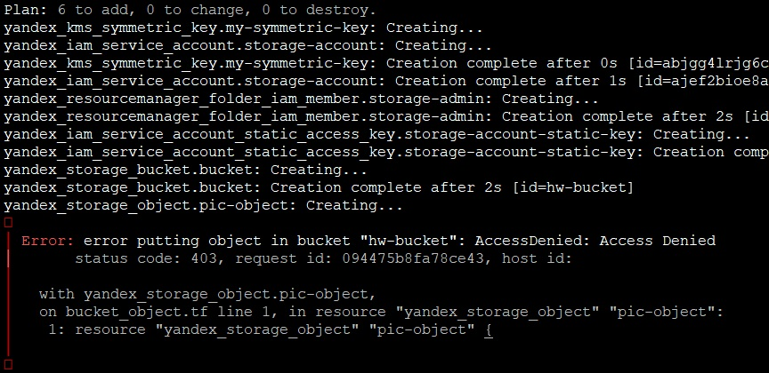

Проверим настройки бакета в интерфейсе, ключ подцепился  
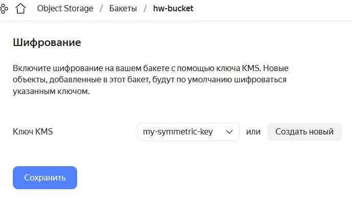

2. Создадим статический [сайт](./terraform_host/index.html) в бакете и сделаем его доступным по https

При помощи openssl создадим сертификат  
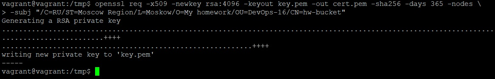

Создадим [сертификат](./terraform_host/certificate.tf) в Certificate Manager в облаке  
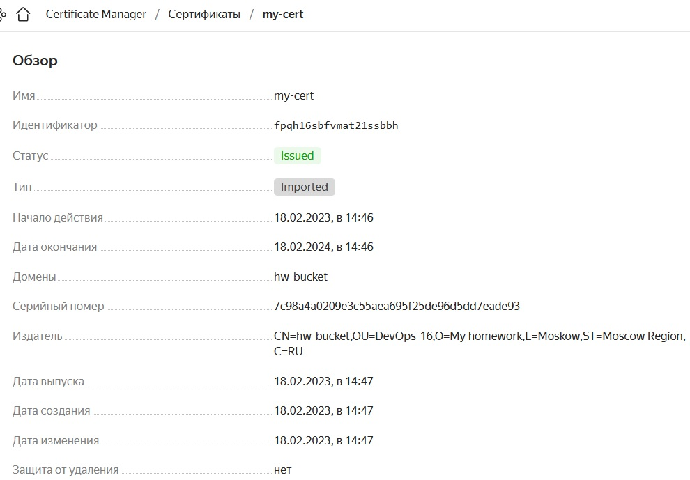

Создадим [bucket](./terraform_host/backet.tf). Укажем в блоке _https_ ссылку на сертификат  
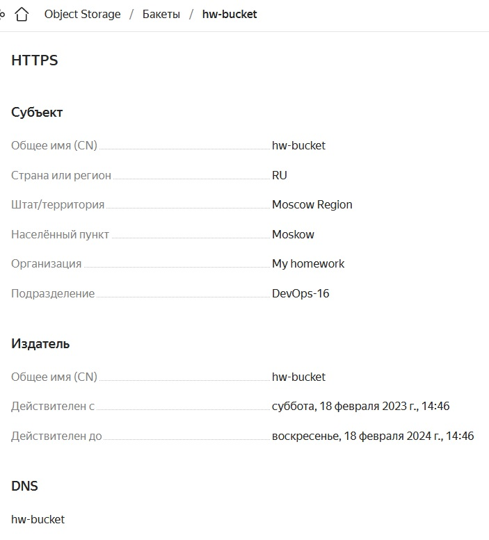

При помощи блока _website_ включим в бакете хостинг сайта  
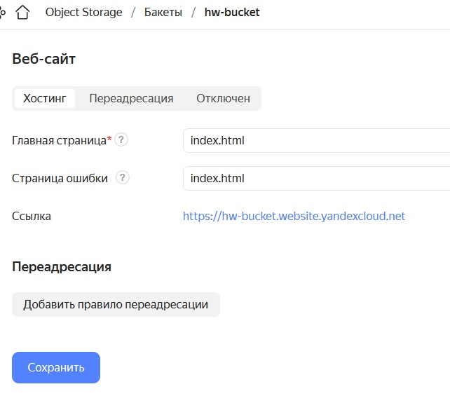

Перейдем по ссылке на сайт  
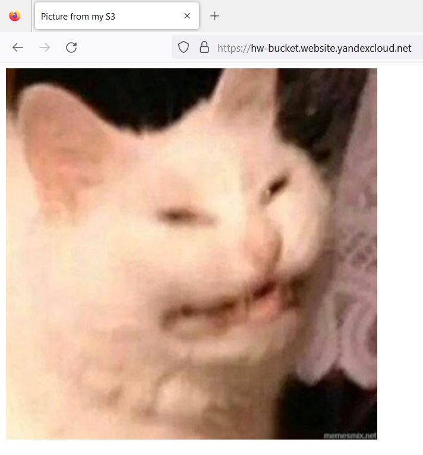

Сайт открылся по https, но на нем висит сертификат yandex.  
Для проверки своего сертификата прописал адрес yandex, в который резолвится hostname, в _hosts_  
`XXX.XXX.XXX.XXX hw-bucket`

Открыл в браузере ссылку на сайт, подтвердил несколько раз исключение безопасности, и мне выдался правильный сертификат  
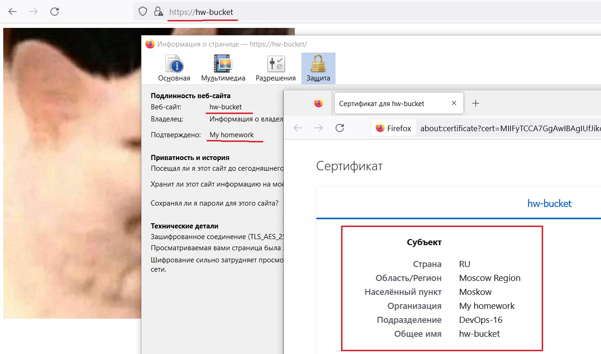

---