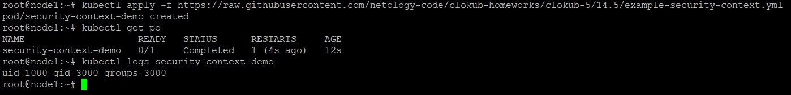
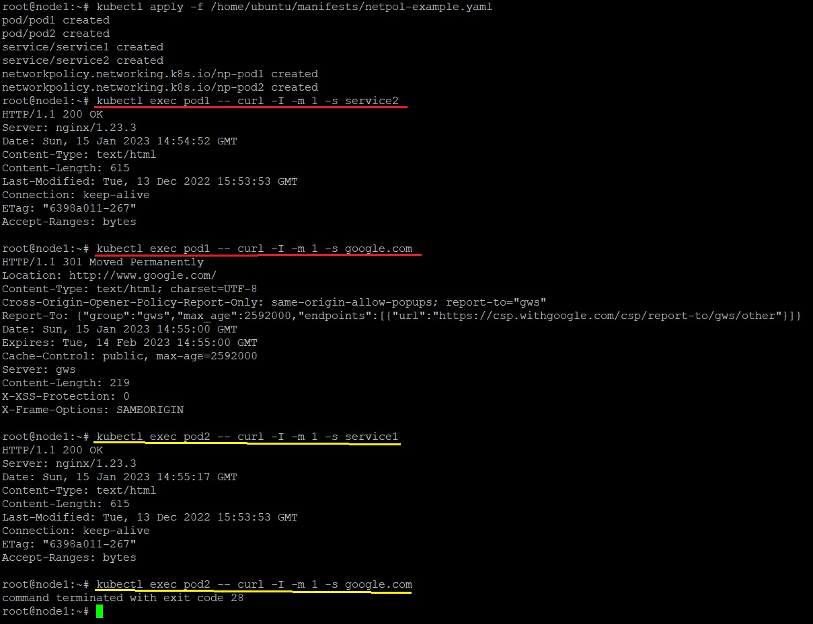
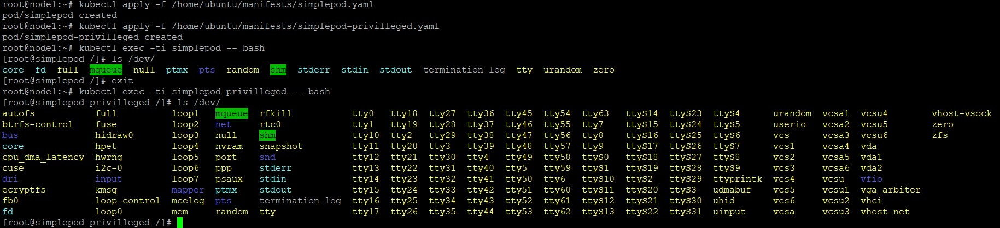
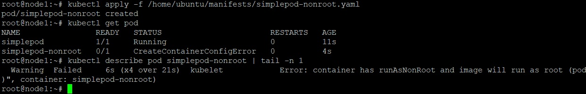
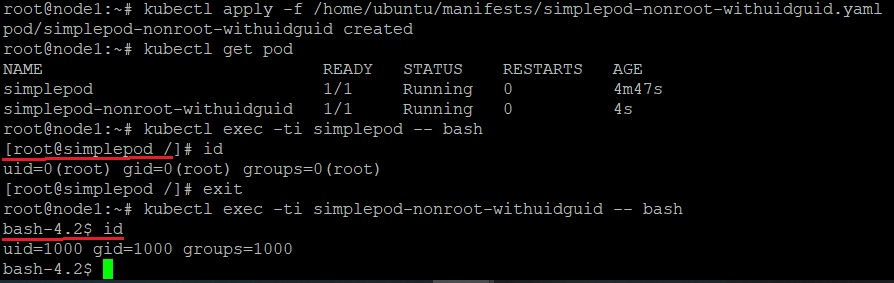
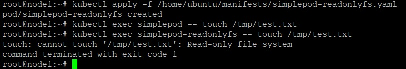
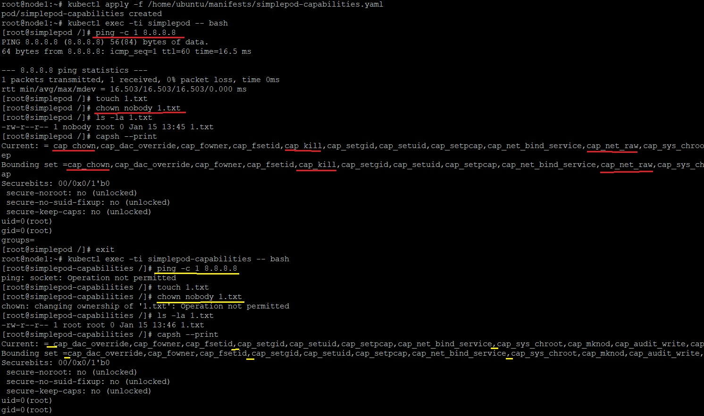

_[Ссылка](https://github.com/netology-code/clokub-homeworks/blob/clokub-5/14.5.md) на задания_

### Задание 1

Задеплоил под из примера, проверил UID и GID. Значения именно те, которые указаны в конфигурации

```yaml
---
apiVersion: v1
kind: Pod
metadata:
  name: security-context-demo
spec:
  containers:
  - name: sec-ctx-demo
    image: fedora:latest
    command: [ "id" ]
    securityContext:
      runAsUser: 1000
      runAsGroup: 3000
```



---

### Задание 2

Собрал тестовый [стенд](./ansible/files/manifests/netpol-example.yaml) с 2 подами, 2 сервисами и 2 _NetworkPolicy_

Проверил взаимодействие между подами и google.com



- из первого пода запросы ходят везде
- из второго только к первому поду

Также ранее использовал _NetworkPolicy_ в домашнем задании 1 [тут](https://github.com/Dracula33/devops-netology/tree/main/homeworks/Kubernetes%20CNI) 

---

### Дополнительно

Посмотрим, как работают разные параметры _securityContext_  
Задеплоим обычный под без каких-либо параметров и будем сравнивать его поведение с другими

```yaml
---
apiVersion: v1
kind: Pod
metadata:
  name: test
spec:
  containers:
  - name: simplepod
    image: centos:centos7
    args:
    - sleep
    - "3600"
```

1. Добавим `privilleged` режим

```yaml
    securityContext:
      privileged: true
```

После его добавления в `/dev` стало доступно намного больше устройств



2. Запретим запуск контейнера под _root_

```yaml
    securityContext:
      runAsNonRoot: true
```



Под просто не запустился.  
Добавим ему дополнительно пользователя и группу
```yaml
      runAsUser: 1000
      runAsGroup: 1000
```



Контейнер запустился, но под другим пользователем

3. Запретим писать на файловую систему контейнера

```yaml
    securityContext:
      readOnlyRootFilesystem: true
```



В базовом контейнере получилось создать файл, в контейнере с _securityContext_ нет

4. Уберем несколько linux capabilities

```yaml
    securityContext:
      capabilities:
        drop:
          - NET_RAW
          - CHOWN
          - KILL
```



После удаления _capabilities_ в контейнере перестали работать `ping`, `chown`, а также пропали все указанные возможности в выводе `capsh`  

---