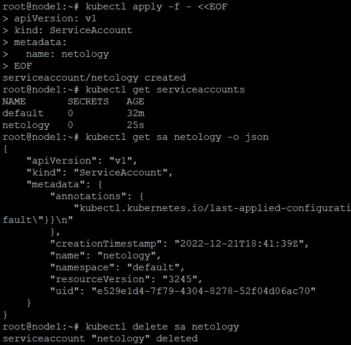
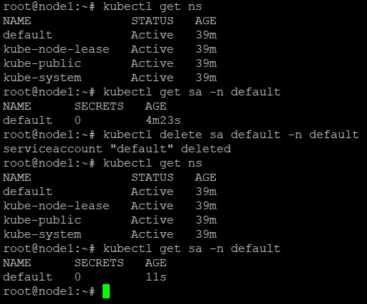
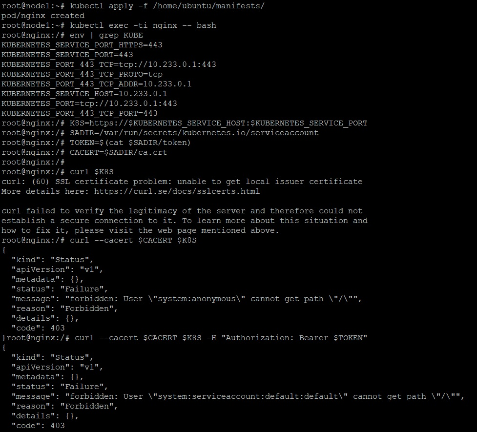
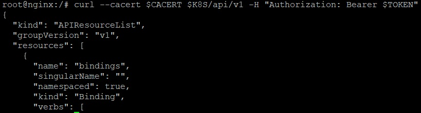
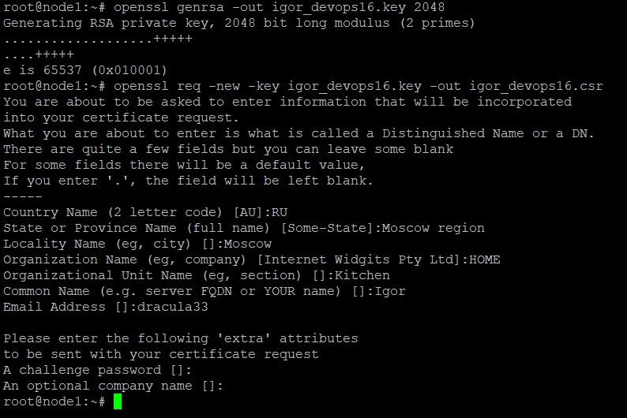
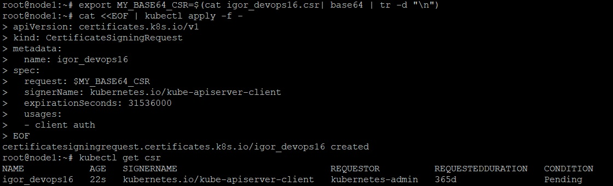
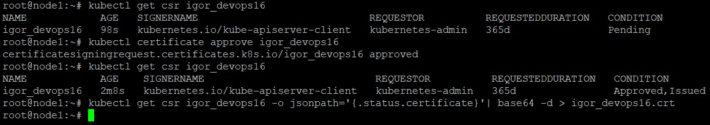
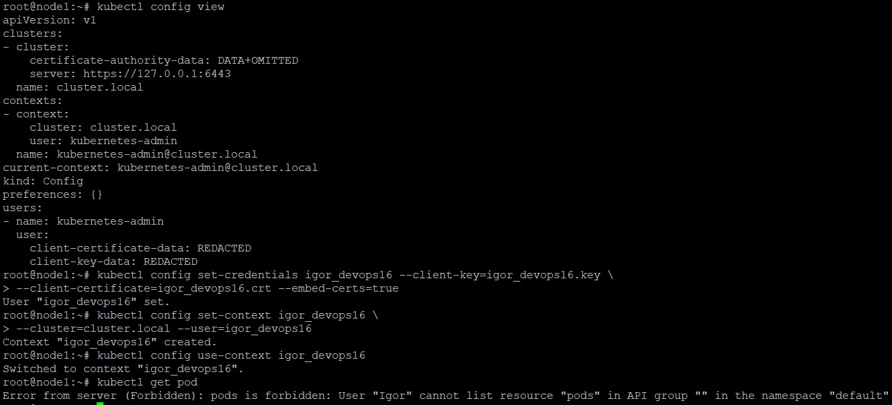
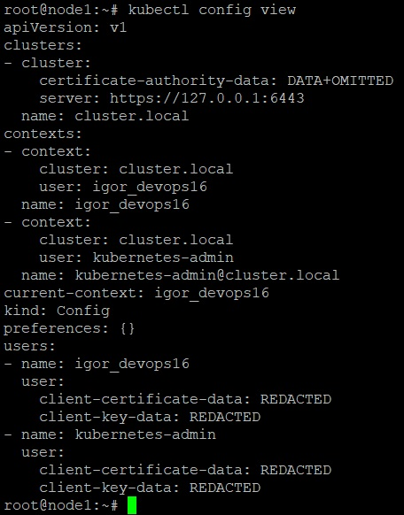
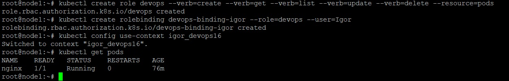

_[Ссылка](https://github.com/netology-code/clokub-homeworks/blob/clokub-5/14.4.md) на задания_

### Задание 1

Создал ServiceAccount. Выполнил несколько команд по работе с ним

Попробовал удалить сервисный аккаунт default в namespace default. Он пересоздался

---

### Задание 2

- Задеплоил под с nginx
- Вывел список переменных
- Разобрался, для чего в _curl_ используется сертификат и авторизация при взаимодействии с api-сервером

Успешно получил вывод _/api/v1_ через _curl_

---

### Дополнительно

Попробовал подключиться к _Kubernetes_ через свой сертификат, а не ServiceAccount

1. Создал свой приватный ключ и запрос на выпуск сертификата

2. Создал объект _CertificateSigningRequest_

3. Принял запрос. Выгрузил из кубера сертификат

4. Добавил в `~/.kube/config` нового пользователя со своим ключем и сертификатом в новый контекст

5. Вывод результирующего конфига

6. Добавил права на просмотр подов, чтобы довести все до логического конца)

---