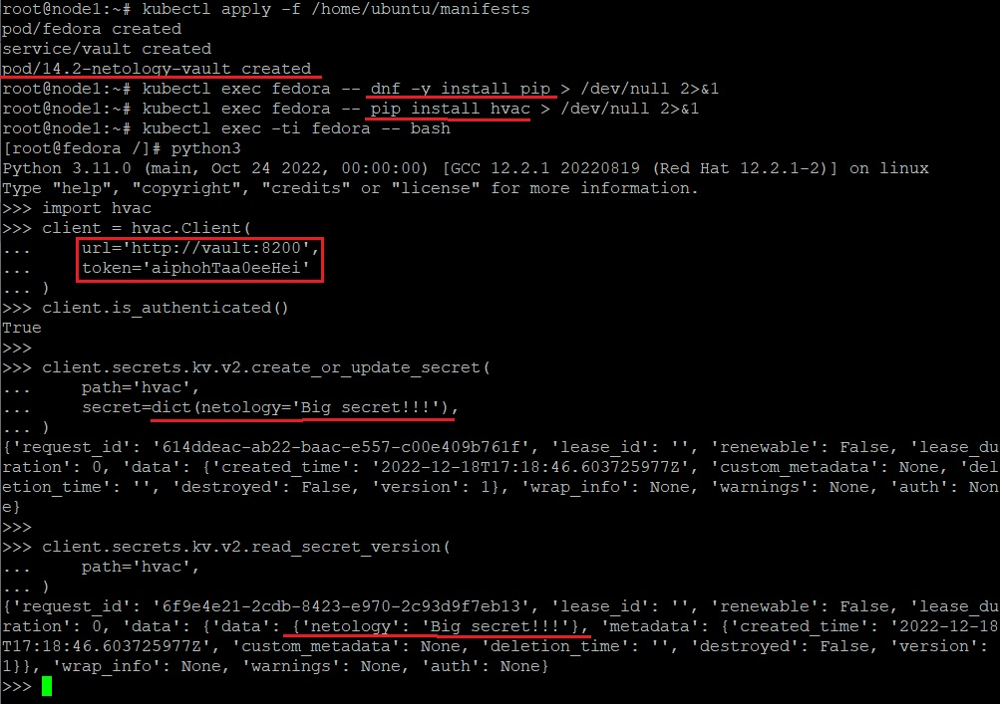

_[Ссылка](https://github.com/netology-code/clokub-homeworks/blob/clokub-5/14.2.md) на задания_

### Задание 1

- Задеплоил под с _Vault_
- Установил _pip_ и _hvac_
- Запустил в _python3_ код для создания и получения секрета



- Проверил, что секрет появился в _Vault_


---

### Задание 2

На основе команд по вызову _hvac_ из предыдущего примера сделаем небольшой скрипт, который будет запрашивать секрет _my_secret_
```python
#!/usr/bin/env python3
import hvac
import os

vault_token = os.getenv('VAULT_TOKEN')

client = hvac.Client(
  url='http://vault:8200',
  token=vault_token
)

result_message = ''

try:
  secret = client.secrets.kv.v2.read_secret_version(
    path='my_secret'
  )
  result_message = secret['data']['data']
except hvac.exceptions.InvalidPath:
  result_message = 'There is no any secrets((('

print(result_message)
```

Создадим объекты, подождем некоторое время, пока запустится под с _fedora_. В него были добавлены команды по установке _pip_ и _hvac_


Запустим в цикле наш скрипт, который будет всем рассказывать наш секрет

```commandline
root@node1:~# while true; do kubectl exec fedora -- /root/app/test_app.py; sleep 5; done
There is no any secrets(((
```

Создадим секрет в Vault через интерфейс


Добавим новую версию нашего секрета


Удалим секрет


Посмотрим на вывод скрипта


Доступ из пода fedora к vault есть. На последнем скрине выводится именно то, что было введено в интерфейсе

---