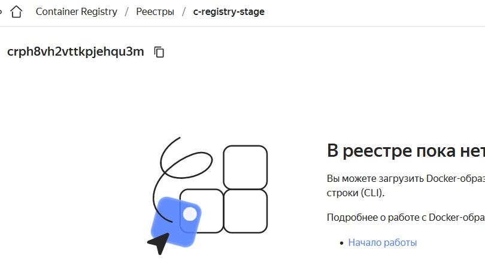

_[Ссылка](https://github.com/netology-code/devops-diplom-yandexcloud) на задание_

### Подготовим конфигурацию по развертыванию инфраструктуры

Конфигурацию поместим в [репозиторий](https://github.com/Dracula33/diploma-app-run)  
В ней содержится:  
1. Создание [bucket](https://github.com/Dracula33/diploma-app-run/tree/master/terraform-state-bucket) для состояни terraform
2. Создание [инфраструктуры](https://github.com/Dracula33/diploma-app-run/tree/master/terraform-infrastructure) для задания
3. [Конфигурация](https://github.com/Dracula33/diploma-app-run/tree/master/ansible) Ansible для раскатывания приложений
4. [Конфигурация](https://github.com/Dracula33/diploma-app-run/blob/master/atlantis.yaml) Atlantis уровня репозитория

Все создается с нуля. Перед запуском объекты в облаке отсутствуют


### Запуск

Запуск осуществляется через [Makefile](https://github.com/Dracula33/diploma-app-run/blob/master/Makefile) командой `make create` с передачей имени _terraform workspace_ в переменной **WORKSPACE**  
Также перед запуском нужно задать несколько переменных для создания bucket и Webhook для Atlantis  


В процессе работы создаются _terraform workspace_  
Далее работа продолжается в том, которорый указан в параметре **WORKSPACE**


После создания инфраструктуры сразу запускается Ansible для установки всего необходимого


К этому моменту в облаке уже созданы все объекты


Пустой регистр образов

  

И четыре виртуальных машины с параметрами из _terraform workspace_ и в разных зонах доступности


3 виртуалки будут использоваться для кластера Kubernetes, одна для CI/CD c Jenkins

### Развертывание

##### Kubernetes
Для развертывания Kubernetes используется Kubespray. Он запускается с control-plane. Лог его установки лежит на нем.


После установки кластера на локальную машину копируется файл с подключением к кластеру и запрашивается информация о нодах


##### Monitoring

Далее через _kube-prometheus_ ставится мониторинг кластера  
Используются стандартные доски из примера их README.

Дополнительно в базовых объектах примера: 
1. Через [Secret](https://github.com/Dracula33/diploma-app-run/blob/master/ansible/files/monitoring/additional-scrape-configs.yaml) добавил джоб для мониторинга своего приложения
2. Добавил свою [доску](https://github.com/Dracula33/diploma-app-run/blob/master/ansible/files/monitoring/grafana-my-dashboard.yaml)
3. В [Prometheus](https://github.com/Dracula33/diploma-app-run/blob/master/ansible/files/monitoring/prometheus-prometheus.yaml#L33) включил свой джоб
```yaml
additionalScrapeConfigs:
    name: additional-scrape-configs
    key: add-job.yaml
```
4. В [Grafana](https://github.com/Dracula33/diploma-app-run/blob/master/ansible/files/monitoring/grafana-deployment.yaml#L71) подмонтировал свою доску
5. Поменял базовый [Service](https://github.com/Dracula33/diploma-app-run/blob/master/ansible/files/monitoring/grafana-service.yaml) Grafana на NodePort

##### Jenkins

Для обработки CI/CD используется Jenkins
После установки пароль для захода в него отображается в логе


При развертывании в Jenkins ставится [Job](https://github.com/Dracula33/diploma-app-run/blob/master/ansible/files/my_cicd/config.xml) для сборки дипломного приложения  
Само описание CI\CD находится в отдельном [репозитории](https://github.com/Dracula33/diploma-app-jenkinsfile/blob/master/Jenkinsfile)

Dockerfile используемого для сборки дипломного приложения лежит [тут](https://github.com/Dracula33/diploma-app)  
Сейчас там есть один коммит и тег.

Для деплоя дипломного приложения в Kubernetes используется конфигурация [Qbec](https://github.com/Dracula33/diploma-app-run/tree/master/ansible/files/qbec-app). Сам [qbec.yaml](https://github.com/Dracula33/diploma-app-run/blob/master/ansible/templates/qbec-app/qbec.yaml.j2) получается шаблоном Jinja  
Деплой в кластер происходит под отдельным [ServiceAccount](https://github.com/Dracula33/diploma-app-run/tree/master/ansible/files/cicd-manifests) с ограничением прав через RBAC

##### Atlantis

Atlantis ставится через официальный Helm Chart  
Для его установки используется следующий [набор](https://github.com/Dracula33/diploma-app-run/blob/master/ansible/templates/atlantis/atlantis_values.yaml.j2) переменных  

### Результат

После окончания деплоя проверим, что у нас получилось

##### Мониторинг

Grafana доступна по порту 30000 любой из нод кластера. В списке стандартных досок есть наша


Выглядит она так. Но работает


Если изменить число реплик в деплойменте приложения, то она будет выглядеть так


На доске есть (слева направо сверху вниз):
1. Флаг текущего состояния приложения
2. Возвращаемый HTTP код в ответе
3. Размер возвращаемого контента. Предположительно, поможет понять, когда изменится версия приложения, так как возвращается статика. 
4. Время обработки запроса.

##### Atlantis

При деплое в GitHub создается WebHook со ссылкой на Atlantis


При переходе по этому порту откроется само приложение


Проверим его работу. Создадим в репозитории ветку _add_cpu_, в которой для _stage_ окружения [увеличим](https://github.com/Dracula33/diploma-app-run/commit/04b27c74ed663b214b5567a2cfde62229abaefbd) число ядер.  
Сделаем [Pull request](https://github.com/Dracula33/diploma-app-run/pull/3) c комментарием _atlantis plan_  
Через какое-то время в комментарии появится результат выполнения `terraform plan`


Проверим, что он предлагает только то, что мы изменили


Ниже будет информация, что команда отработала корректно


На скрине выше есть информация, что для _prod_ окружения предлагается создать 12 объектов. Все верно, мы создали только _stage_, в _prod_ объекты отсутствуют

##### Jenkins

Jenkins доступен по порту 8080 на сервере CI\CD

  

В нем автоматически сработал джоб, который собрал Docker образ по имеющемуся коммиту и поместил его в Registry


Так как у нас уже был тег, приложение автоматически задеплоилось в кластер Kubernetes через Qbec. 
Приложение доступно через порт 32000 любой из нод кластера


### Что хотелось бы доделать, но не успел

1. Настроить балансировщик, чтобы ходить везде по 80 порту с разными path
3. Сделать авторизацию в Registry
4. Лучше разобраться с kube-prometheus, построить свой мониторинг, а не менять имеющийся пример