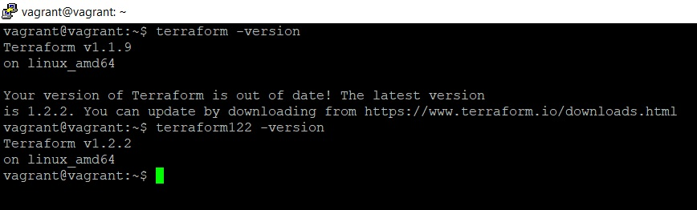

### Задача 1

#### 1. Ответы на вопросы

> Какой тип инфраструктуры будем использовать для этого проекта: изменяемый или не изменяемый?

Коллеги, подскажите, какой тип услуг планируется оказывать? Если финансовые, то стоит задуматься о неизменяемой инфраструктуре.  
Если же что-то другое, то частые релизы, тесты интеграций и доработок проще делать на _изменяемой._ 

> Будет ли центральный сервер для управления инфраструктурой?

На сколько сильным будет прирост производительности со временем? Скорее всего, на начальном этапе для нескольких клиентов не потребуется много железа. Администрировать эти машины можно будет с рабочей машины, _центральный сервер не понадобится._ 

> Будут ли агенты на серверах?

Серверов немного, _агентов на них не будет._ К тому же, управлять конфигурациями будем при помощи Ansible (у нас уже есть наработки), он работает поверх обычного SSH

> Будут ли использованы средства для управления конфигурацией или инициализации ресурсов?

_Конечно будут._ Как минимум, если что-то случится, нам будет проще все восстановить. Инфраструктуру опишем на Terraform. Остатки Cloud Formation также переведем на Terraform. Появится возможность соскочить с AWS, если понадобится. Про Ansible для управления конфигурацией я уже рассказывал.

#### 2. Список используемых инструментов

* _Packer_. Будем собирать образ OS и использовать его при инииализации виртуалок
* _Terraform_ (остатки Cloud Formation стоит тоже переписать на Terraform, чтобы нужно было поддерживать только одну систему инициализаии ресурсов)
* _Kubernates_ (так как есть большая база. Возможно, он заменит docker в плане контейнеров для разработчиков)
* _Ansible_ (Естественно. Надо посмотреть на bash скрипты, возможно, он поможет от них избавиться)
* _Teamcity_ (если он уже глубоко вошел в автоматизацию процессов, то берем его)

#### 3. Что еще можно использовать для проекта

В легенде ничего не сказано про это:
* можно использовать Zabbix для мониторинга
* какую-нибудь БД для хранения информации.
* git для хранения конфигураций

---

### Задача 2

---

### Задача 3

---