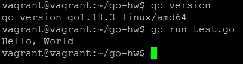
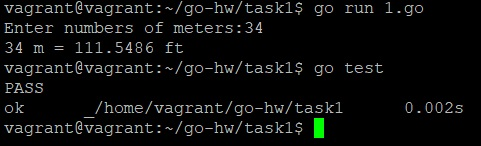
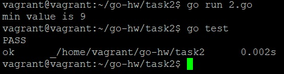
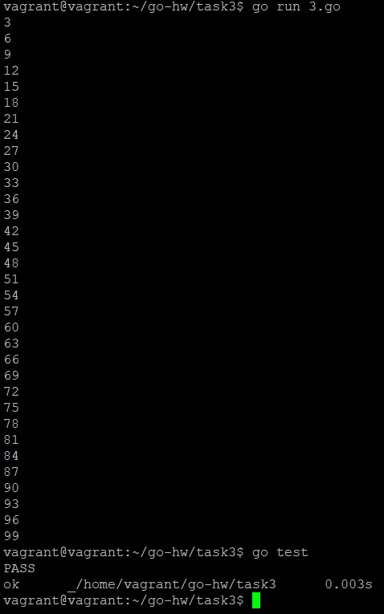

_[ссылка](https://github.com/netology-code/virt-homeworks/tree/master/07-terraform-05-golang) на задания_

### Задача 1

Установил Go и запустил пример с Hello World



---
### Задача 2

В процессе. Пока дошел до условий

---
### Задача 3

_1.go_

```terraform
package main

import "fmt"

const ft float64 = 0.3048

func m2f(numOfMeters float64) float64 {
        return numOfMeters / ft
}

func main(){
        fmt.Print("Enter numbers of meters:")
        var input float64;
        fmt.Scanf("%f",&input);

        fmt.Printf("%g m = %.4f ft\n", input, m2f(input))
}
```

Вывод с тестами:



_2.go_

```terraform
package main

import "fmt"

func find_min(arr []int) int {
        var min_value = arr[0]
        for _, j := range arr {
                if j < min_value {
                        min_value = j;
                }
        }
        return min_value
}

func main(){
        x := []int{48,96,86,68,57,82,100,63,70,37,34,83,27,19,97,9,17,33}
        fmt.Printf("min value is %d\n", find_min(x) )

}
```

Вывод с тестами:



_3.go_

```terraform
package main

import (
        "fmt"
        "math"
)

func is_digit_mod_3(digit int) bool {
        res := false
        if int(math.Mod(float64(digit), 3)) == 0 { res = true }
        return res
}

func main(){
        for i := 1; i <= 100; i++ {
                if is_digit_mod_3(i) {
                        fmt.Printf("%d\n",i)
                }
        }
}
```

Вывод с тестами:



---
### Задача 4

_1_test.go_

```terraform
package main

import (
        "testing"
        "fmt"
)

func Test_3meters_to_ft(t *testing.T) {
        var res float64;
        res = m2f(3)
        exp := "9.8425"
        if fmt.Sprintf("%.4f", res) != exp {
                t.Errorf("Res=%f, expected %s", res, exp)
        }
}
```

_2_test.go_

```terraform
package main

import "testing"

func Test_findMin(t *testing.T) {
        res := find_min([]int{3,5,10,45,-3,94,22,76,15,75,0,33})
        exp := -3
        if res != exp {
                t.Errorf("Res=%d, expected %d", res, exp)
        }
}
```

_3_test.go_

```terraform
package main

import "testing"

func Test_is_6_mod_3(t *testing.T) {
        var res bool;
        res = is_digit_mod_3(6)
        exp := true
        if res != exp {
                t.Errorf("Res=%t, expected %t", res, exp)
        }
}

func Test_is_7_mod_3(t *testing.T) {
        var res bool;
        res = is_digit_mod_3(7)
        exp := false
        if res != exp {
                t.Errorf("Res=%t, expected %t", res, exp)
        }
}
```

Результат работы тестов на скринах 3 задания

---