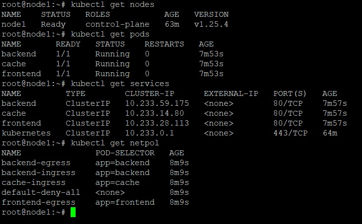
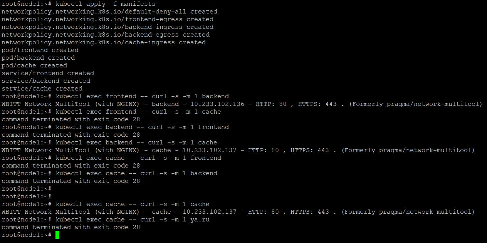
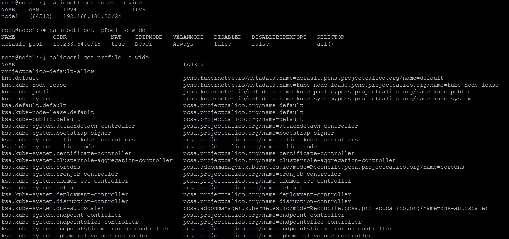

_[Ссылка](https://github.com/netology-code/devkub-homeworks/blob/main/12-kubernetes-05-cni.md) на задания_

### Задание 1

Установил кластер при помощи [Kubespray](./ansible/site.yml)  
Создал объекты для тестов

Проверил, что доступны работают согласно [политикам](./ansible/files/manifests/network-policies.yaml)

Единственное, у всех подов остался доступ по localhost

---

### Задание 2

Установил `calicoctl`, ознакомился с объектами

---