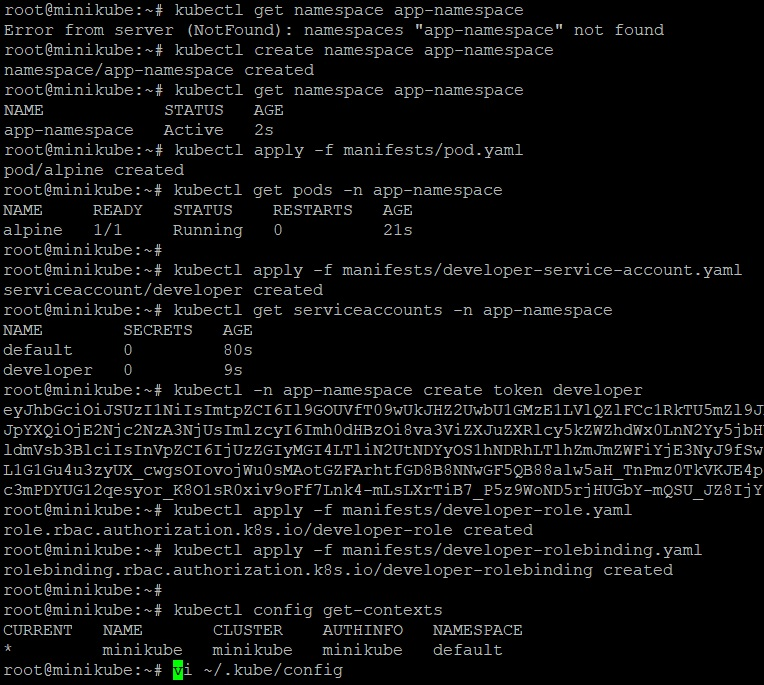

_[Ссылка](https://github.com/netology-code/devkub-homeworks/blob/main/12-kubernetes-02-commands.md) на задания_

### Задание 1

Запустим deployment при помощи манифеста [hello-deployment.yaml](./ansible/files/manifests/hello-deployment.yaml)  
Выполним несколько проверочных команд


---

### Задание 2

Создадим:  
- неймспейс _app-namespace_
- запустим в новом неймспейсе тестовый [pod](./ansible/files/manifests/pod.yaml)
- [ServiceAccount](./ansible/files/manifests/developer-service-account.yaml) _developer_
- получим токен для нового сервисного аккаунта
- [Role](./ansible/files/manifests/developer-role.yaml) _developer-role_
- [RoleBinding](./ansible/files/manifests/developer-rolebinding.yaml) _developer-rolebinding_



- добавим контекст для проверки нового пользователя
```yaml
...
contexts:
- context:
    cluster: minikube
    namespace: app-namespace
    user: developer
  name: minikube-developer
...
users:
- name: developer
  user:
    token: ey....
```
- переключимся на него
- выполним разрешенные операции get, logs, describe
- попробуем выполнить что-то еще


---

### Задание 3

Сначала увеличим число реплик через `kubectl edit` до 3, потом через `kubectl scale` поднимем их число до 5  


---