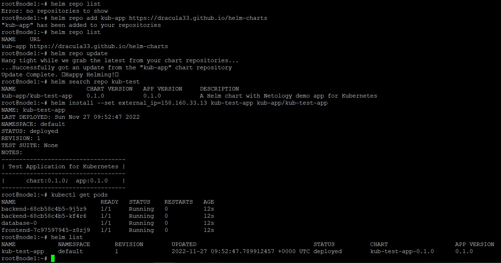
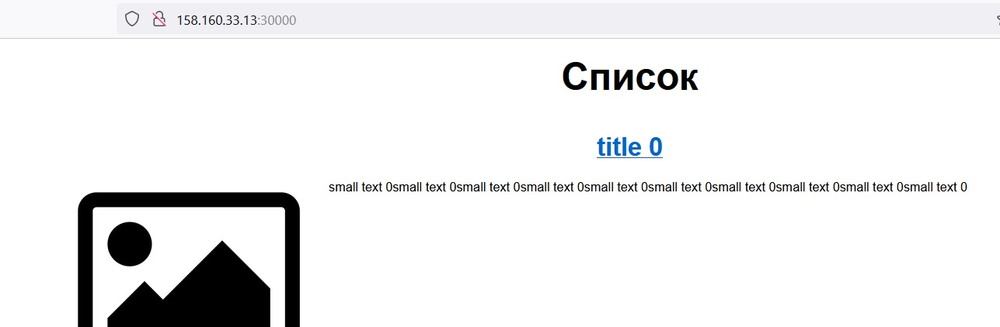
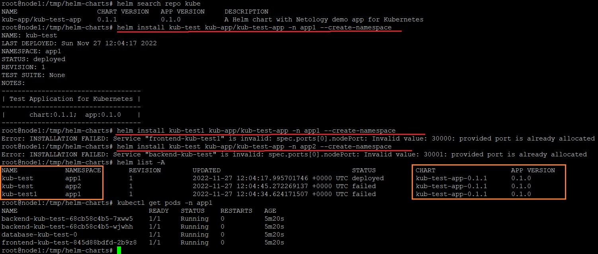

_[Ссылка](https://github.com/netology-code/devkub-homeworks/blob/main/13-kubernetes-config-04-helm.md) на задания_

### Задание 1

Упаковал тестовое приложение в Helm Chart с названием _kub-test-app_  
По [инструкции](https://medium.com/@mattiaperi/create-a-public-helm-chart-repository-with-github-pages-49b180dbb417) поместил его в [репозиторий](https://github.com/Dracula33/helm-charts/tree/master/charts/kub-test-app)  
Задеплоил

После перезапуска подов _backend_ открылся интерфейс  

---

### Задание 2

Изменил формирование имен объектов с использованием суффикса названия релиза. Выпустил версию чарта 0.1.1  
Задеплоил её два раза в одинаковый namespace и один раз в другой

Из-за явного задания _nodePort_ приложение не смогло запуститься, так как порт занят.  
Но информация об установленных приложениях одной версии появилась в `helm list` 

---