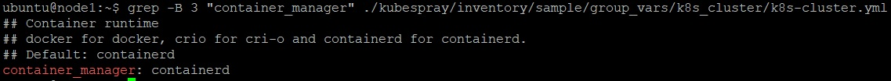
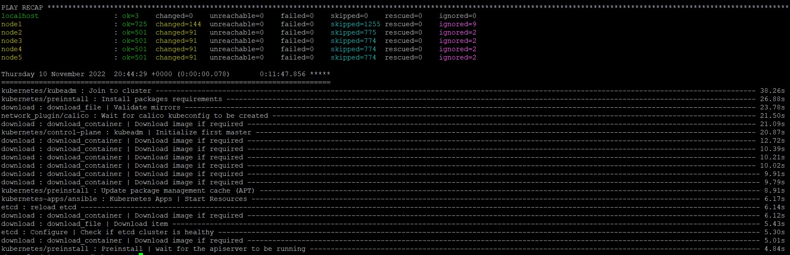
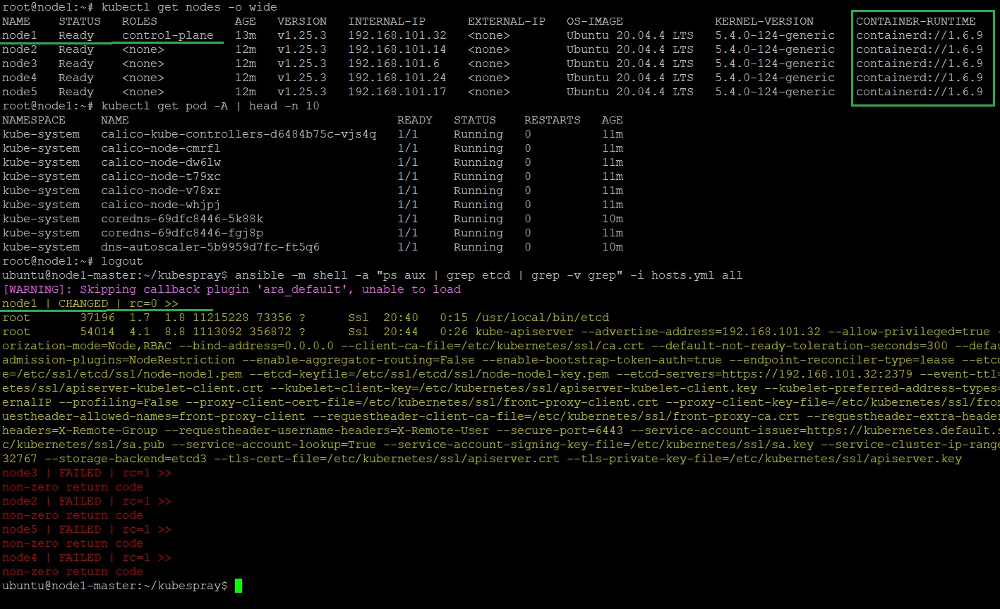

_[Ссылка](https://github.com/netology-code/devkub-homeworks/blob/main/12-kubernetes-04-install-part-2.md) на задания_

### Задание 1

Подготовил [inventory](./terraform_host/inventory.tf) следующего вида:

```yaml
---
all:
  hosts:
    node1:
      ansible_host: XXX.XXX.XXX.XXX
    node2:
      ansible_host: XXX.XXX.XXX.XXX
    node3:
      ansible_host: XXX.XXX.XXX.XXX
    node4:
      ansible_host: XXX.XXX.XXX.XXX
    node5:
      ansible_host: XXX.XXX.XXX.XXX
  children:
    kube_control_plane:
      hosts:
        node1:
    etcd:
      hosts:
        node1:
    kube_node:
      hosts:
        node2:
        node3:
        node4:
        node5:
    k8s_cluster:
      children:
        kube_control_plane:
        kube_node:
  vars:
    ansible_connection_type: paramiko
    ansible_user: ubuntu
```

CRI containerd используется по умолчанию



Запустил плейбук



Проверил: 
- что нод действительно 5
- поды работают
- используется containerd 
- etcd запущен на control-plane



---