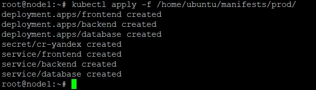
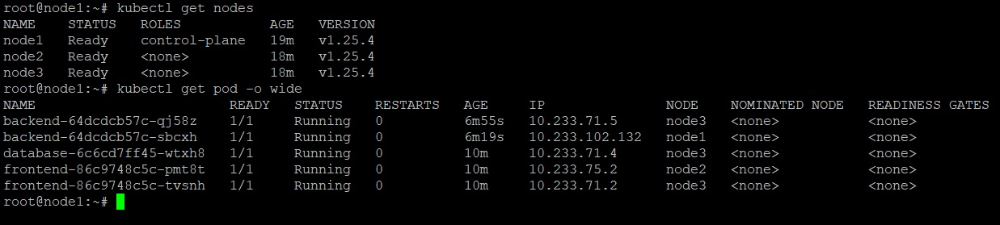
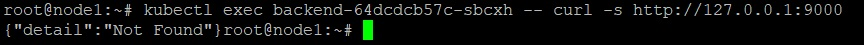
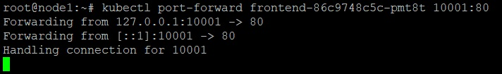
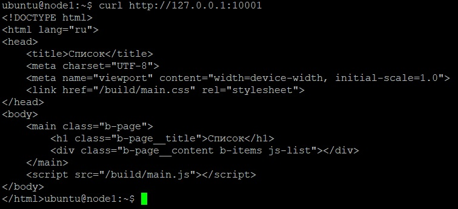
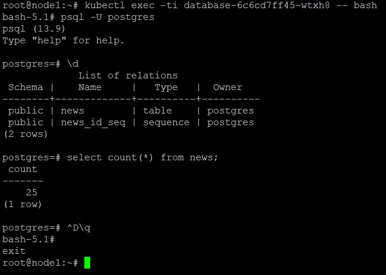
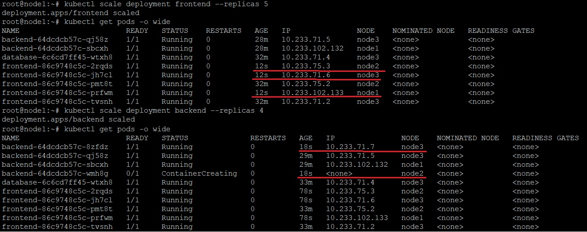
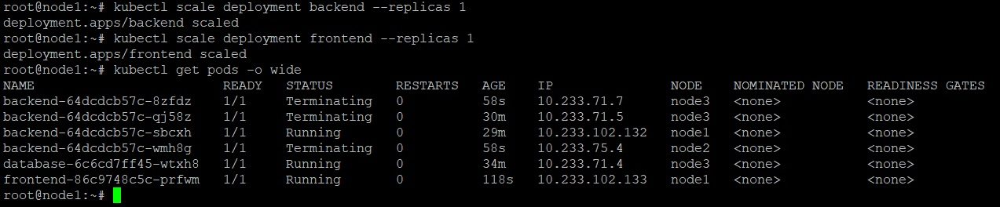
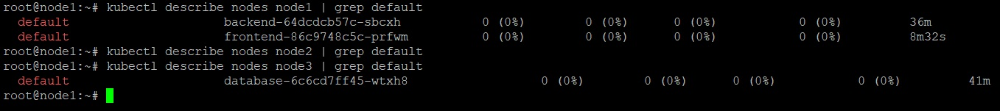

_[Ссылка](https://github.com/netology-code/devkub-homeworks/blob/main/13-kubernetes-config-03-kubectl.md) на задания_

### Задание 1

Задеплоил приложение на кластере из трех нод. 

Оказалось, сложнее чем на одной.
- из сервисов убрал `externalIp`, чтобы воркеры не падали после деплоя
- добавил [secret](./ansible/templates/manifests/secret_registry.yaml.j2), чтобы воркеры могли забрать образы из Container Registry

Попробовал подключиться к backend через `exec`, получил ответ

Пробросил порт через `port-forward` к frontend

В соседнем терминале выполнил запрос на проброшенный порт, получил ответ

Через интерактивный режим `exec -ti` получил число записей в таблице _news_

---

### Задание 2

Через `scale` увеличил число реплик _frontend_ и _backend_. Поды разбежались по всем нодам

Уменьшил число реплик до одной. Все лишние остановились

Проверил также через `describe`, где остались поды. Оказалось, на _node2_ подов приложения не осталось

---