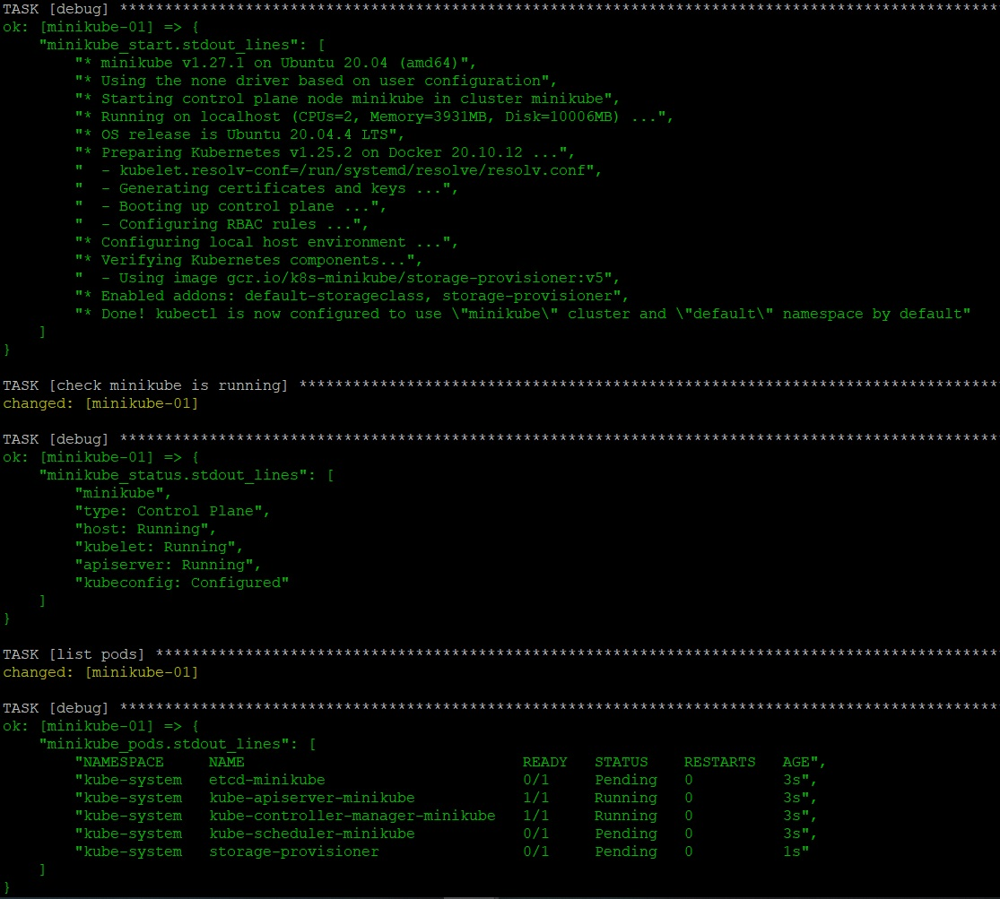
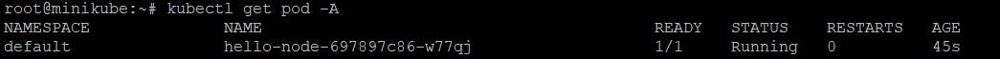
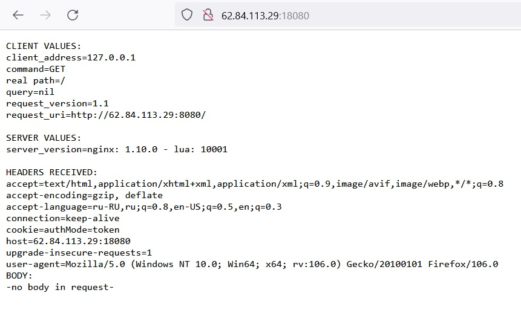
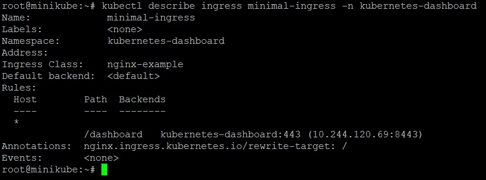
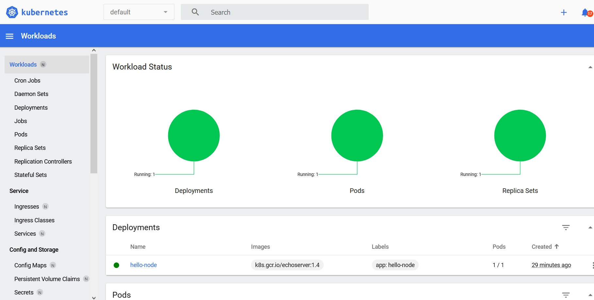
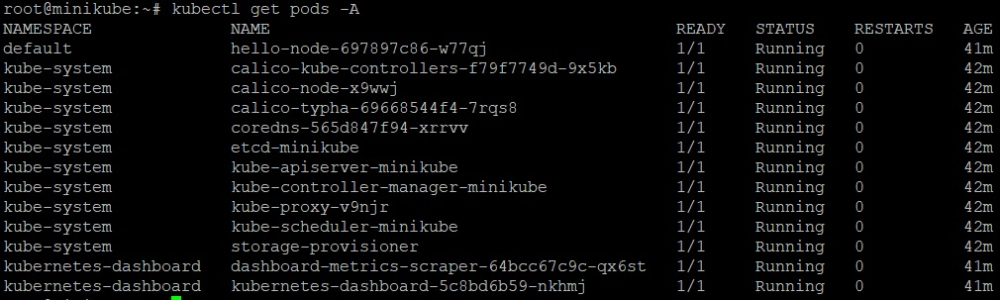
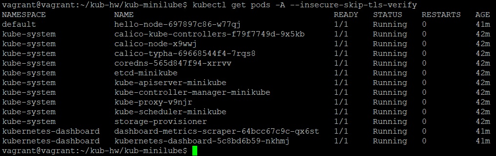

_[Ссылка](https://github.com/netology-code/devkub-homeworks/blob/main/12-kubernetes-01-intro.md) на задания_

### Задание 1

Установил minikube.  
Запустил через `minikube start --vm-driver=none`  
Вывод версии, статуса и списка подов ниже  



---

### Задача 2

Задеплоил тестовое приложение



Через `port-forward` зашел в него



Поставил _dashboard_, попробовал настроить [ingress](./ansible/files/dashboard-access/ingress.yaml) для доступа внутрь.  
Ингресс запустился, но, к сожалению, попасть внутрь через него не получилось. Браузер возвращал 404



Попал внутрь также через проброс порта и сгенерированный токен
```commandline
root@minikube:~# kubectl port-forward --address 192.168.101.23 kubernetes-dashboard-5c8bd6b59-nkhmj 10001:8443 -n kubernetes-dashboard
```



---

### Задание 3

Получил список подов для сравнения конфигов `kubectl`



Скопировал с виртуалки с миникубом admin.conf к себе на машину  
Поменял в нем адрес `server: https://62.84.113.29:8443`  
Выполнил аналогичную команду с параметром игнорирования сертификата



---
