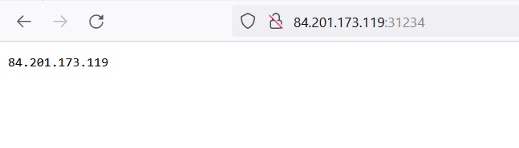

_[Ссылка](https://github.com/netology-code/devkub-homeworks/blob/main/13-kubernetes-config-01-objects.md) на задания_

### Задание 1

Задеплоил stage окружение при помощи манифестов:
- [statefulset](./ansible/files/manifests/stage/statefulset.yaml)
- [deployment](./ansible/templates/manifests/stage/deployment.yaml.j2)
- [services](./ansible/templates/manifests/stage/services.yaml.j2)

Проверил запущенность объектов

Проверил интерфейс тестового приложения

---

### Задание 2

Добавил несколько объектов к заданию 1. Получились следующие манифесты:
- [deployment_db](./ansible/files/manifests/prod/deployment_db.yaml)
- [deployment](./ansible/templates/manifests/prod/deployment.yaml.j2)
- [services](./ansible/templates/manifests/prod/services.yaml.j2)

Задеплоил новые манифесты, проверил объекты и перменные

Интерфейс также открылся

---

### Задание 3

Создал Service и Endpoints через [манифест](./ansible/files/manifests/endpoint/service_endpoint.yaml)  
Endpoints указывает на сайт [ident.me](http://ident.me), который просто показывает ваш ip

Открыл NodePort сервиса в браузере

---