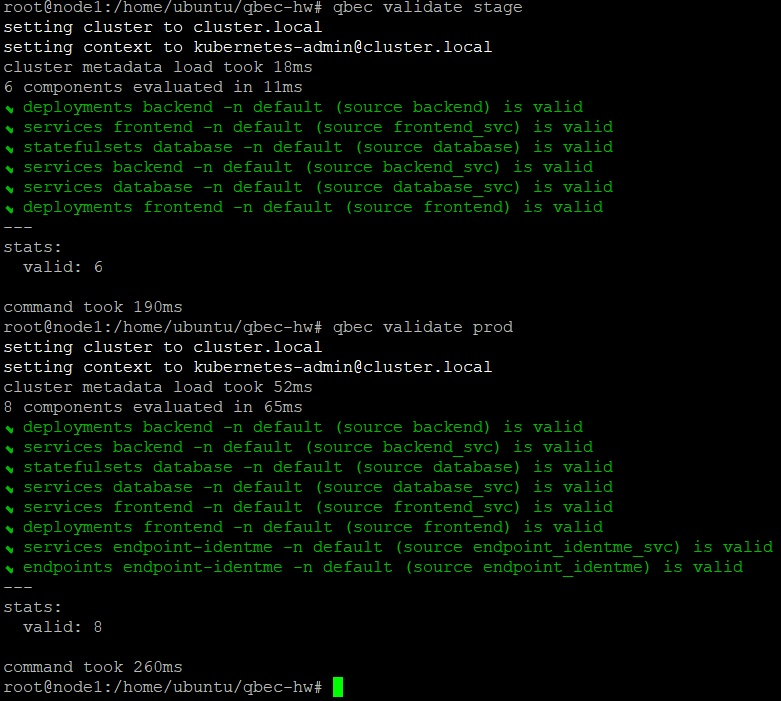
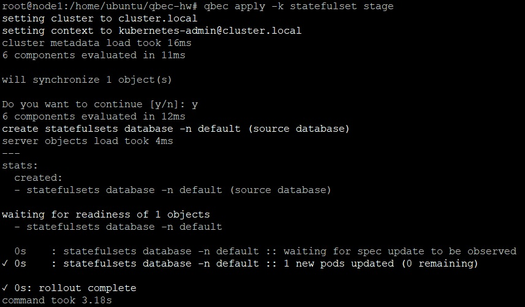

_[Ссылка](https://github.com/netology-code/devkub-homeworks/blob/main/13-kubernetes-config-05-qbec.md) на задания_

### Задание 1

Описал [конфигурацию](./ansible/files/qbec-hw/qbec.yaml) qbec для двух окружений  
Добился, чтобы она была валидной

Попробовал команды вывода компонентов и параметров

Задал для _prod_ большее количество реплик

Отдельно задеплоил _statefulset_, так как БД поднимается дольше backend  

Потом задеплоил все оставшееся кроме БД

Очень удобно, интерфейс открылся без перезапуска подов _backend_)

Освоил команду удаления окружения

Аналогичным образом задеплоил _prod_, с списке объектов появились _Endpoints_ и _Service_ для него

---