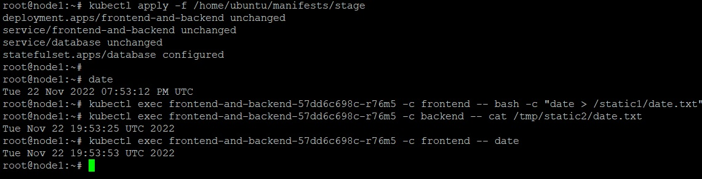
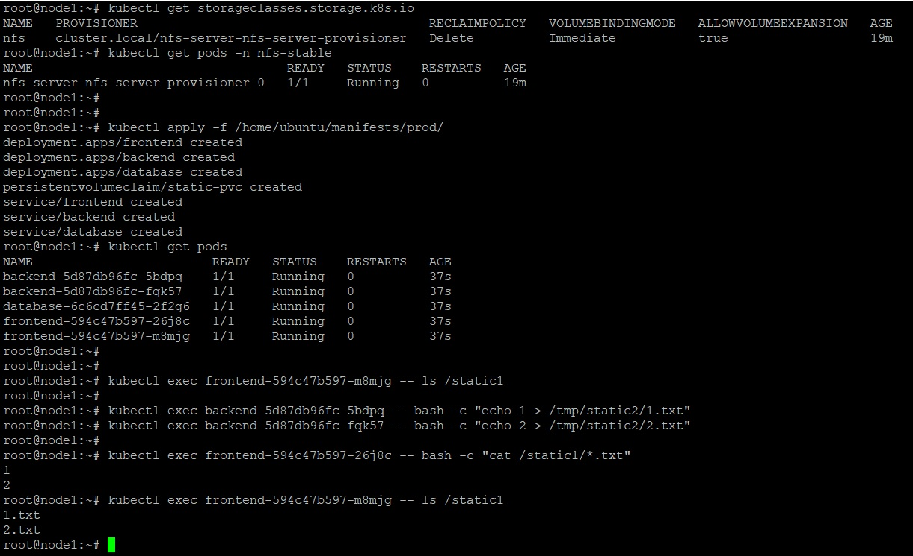
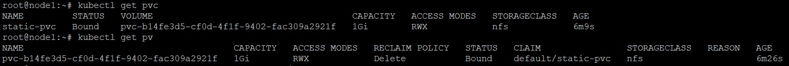

_[Ссылка](https://github.com/netology-code/devkub-homeworks/blob/main/13-kubernetes-config-02-mounts.md) на задания_

### Задание 1

Изменил [deployment](./ansible/templates/manifests/stage/deployment.yaml.j2) для stage, добавил блок с volume  

```yaml
  containers:
    - image: frontend_hw:0.1
      ...
      volumeMounts:
        - mountPath: "/static1"
          name: static-dir
    - image: backend_hw:0.1
      ...
      volumeMounts:
        - mountPath: "/tmp/static2"
          name: static-dir
  volumes:
    - name: static-dir
      emptyDir: {}
```

Задеплоил, проверил. Файл, созданый в одном контейнере, доступен в другом 



---

### Задание 2

Изменил [deployment-ы](./ansible/templates/manifests/prod/deployment.yaml.j2) для prod. Добавил volume  
На примере frontend:
```yaml
      volumeMounts:
        - mountPath: /static1
          name: static-volume
  volumes:
    - name: static-volume
      persistentVolumeClaim:
        claimName: static-pvc
```

Сделал манифест для [PersistentVolumeClaim](./ansible/files/manifests/prod/persistent_volume_claim.yaml)
```yaml
---
apiVersion: v1
kind: PersistentVolumeClaim
metadata:
  name: static-pvc
spec:
  storageClassName: "nfs"
  accessModes:
    - ReadWriteMany
  resources:
    requests:
      storage: 1Gi
```

Поставил provisioner, задеплоил манифесты, проверил. Фалы доступны во всех 4 подах



На основе PersistentVolumeClame provisioner создал PersistentVolume



---