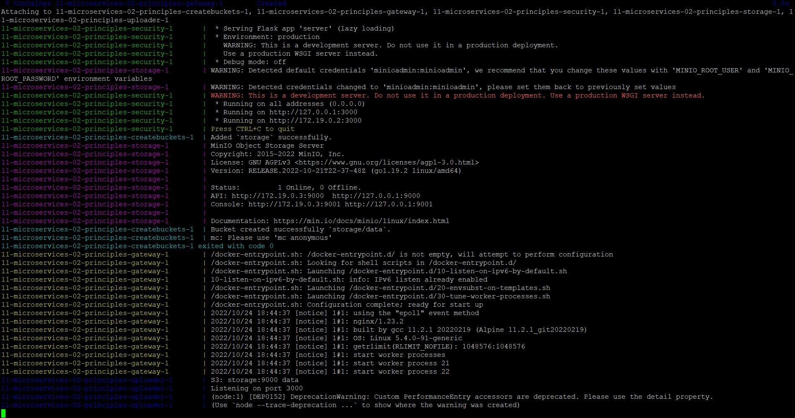
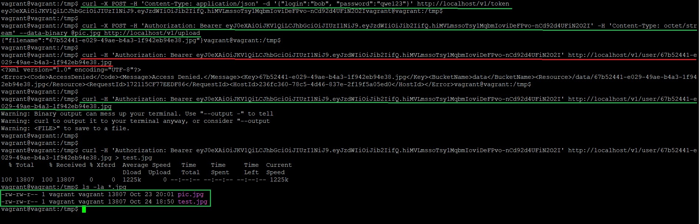
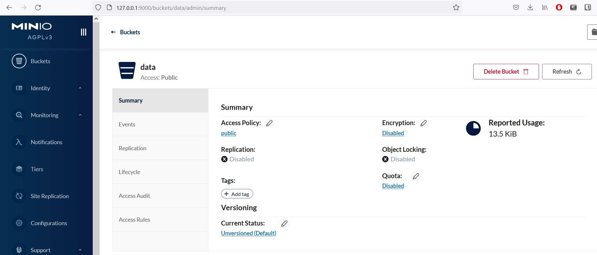
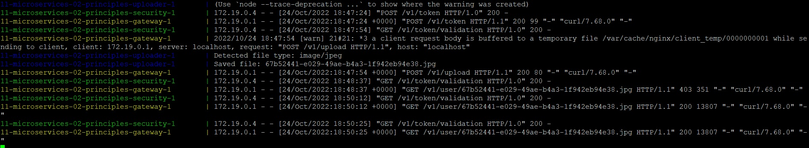

_[Ссылка](https://github.com/netology-code/devkub-homeworks/blob/main/11-microservices-02-principles.md) на задания_

### Задание 1

Думаю, что для данной задачи можно рассматривать Nginx, HAProxy и F5 Load balancer  
F5 - платное решение, его пока сразу стоит убрать из списка, если никто из первых двух не подойдет   

Для составления таблицы пользовался этими статьями:  
1. [NGINX and HAProxy: Testing User Experience in the Cloud](https://www.nginx.com/blog/nginx-and-haproxy-testing-user-experience-in-the-cloud/)
2. [HAProxy vs Nginx – What’s the Difference? (Pros and Cons)](https://cloudinfrastructureservices.co.uk/haproxy-vs-nginx-whats-the-difference/)

|                           Что сравниваем | Nginx | HAProxy |  
|-----------------------------------------:|:-----:|:-------:|  
| Маршрутизация запросов к нужному сервису |   Х   |    Х    |
|                           Аутентификация |   Х   |    Х    |
|                        Поддержка SSL\TLS |   Х   |    Х    |
|      дополнительно является web-сервером |   Х   |         |
|                  поддержка gRPC, FastCGI |   Х   |    X    |
|            поддержка почтовых протоколов |   Х   |         |
|                 поддерживает кеширование |   X   |    X    |
|         используется в крупных компаниях |   X   |    X    |
|   есть экспортеры метрик для мониторинга |       |    X    |
|                  есть статусная страница |       |    X    |
|      читабельный конфиг(по моему мнению) |   X   |         |

На основе поставленной задачи предположу, что стоит обрабатывать только HTTP трафик, мониторить ничего не будем, а вебсервер будет сторонний. Вся сравнительная разница из таблицы улетучивается.  
Делаем выбор на основе читаемого конфига и сравнительных тестов производительности.  
Я выбираю **Nginx**

---

### Задание 2

[Список](https://ru.wikipedia.org/wiki/%D0%91%D1%80%D0%BE%D0%BA%D0%B5%D1%80_%D1%81%D0%BE%D0%BE%D0%B1%D1%89%D0%B5%D0%BD%D0%B8%D0%B9) брокеров сообщений достаточно большой. Возьму несколько из них для сравнения

Для сравнения использовал документацию брокеров и дополнительные ссылки:
1. [Artemis](https://activemq.apache.org/components/artemis/documentation/latest/)
2. [Kafka](https://kafka.apache.org/documentation/#gettingStarted)
3. [OpenMq](https://javaee.github.io/glassfish/doc/4.0/mq-admin-guide.pdf)
4. [RabbitMq](https://www.rabbitmq.com/admin-guide.html)
5. [Stress-Testing MQTT Brokers](https://www.google.com/url?sa=t&rct=j&q=&esrc=s&source=web&cd=&ved=2ahUKEwiHuv_00fb6AhUvmIsKHcV_CcMQFnoECBAQAQ&url=https%3A%2F%2Fmdpi-res.com%2Fd_attachment%2Fenergies%2Fenergies-14-05817%2Farticle_deploy%2Fenergies-14-05817-v2.pdf&usg=AOvVaw1KkfBvpJaZ4RzPL0dO4Rlt)

|                           Что сравниваем | Artemis | Kafka | OpenMq | RabbitMq |  
|-----------------------------------------:|:-------:|:-----:|:------:|:--------:|  
|                  Поддержка кластеризации |    X    |   X   |   X    |    X     |
|                          Персистентность |    X    |   X   |   X    |    X     |
|               Высокая скорость работы[1] |   XX    | XXXX  |   X    |   XXX    |
|   Поддержка разных форматов сообщений[2] |    X    |   X   |   X    |    X     |
| Разделение прав доступа к разным потокам |    X    |   X   |   X    |    X     |
|                 Простота эксплуатации[3] |    X    |       |   X    |    X     |
|                  Выходят ли новые версии |    X    |   X   |        |    X     |

1 - Найденные мной тесты производительности не дают явно сравнить работу выбранных брокеров, потому что проводятся на  проводятся на разном железе.   
К примеру, Artemis показывает производительность 40к сообщений в секунду. Kafka и RabbitMq часто сравниваются по производительности в высоконагруженных системах, но по масштабируемости Kafka выигрывает.  
Я бы расположил этот пункт в порядке возрастания пропускной способности, но без подтверждения: OpenMq, Artemis, RabbitMq, Kafka.  
Но для базовых потребностей (не знаю, какое значение нужно в текущей задаче), по моему мнению, достаточно и OpenMq. Либо же надо проводить тесты на одном железе

2 - Найденная мной информация показывает, что все брокеры могут обрабатывать текстовые и бинарные сообщения. Считаю, что все поддерживают разные форматы

3 - Самому удалось поработать с Artemis, Openmq и Kafka. Для запуска Openmq нужно было распаковать архив и запустить брокер, Artemis примерно также.  
Судя по инструкции по установке, RabbitMQ запускается тоже довольно просто.  
У Kafka снял галочку из-за встреченных мною ранее проблем с подключением.  
Нужно было подобрать метод аутентификации SASL, указать JAAS конфиг с логином и паролем и подключаться через стороннее приложение Zookiper.  
Считаю, что все эти компоненты поддерживать сложнее, чем приложение в архиве или контейнере.

Из выбранных мною брокеров, я остановлюсь на **RabbitMQ**. По моему мнению он производительнее Artemis, также довольно прост в использовании и периодически обновляется. Так как в задаче не было особых требований к производительности, тянуть тяжелую Kafka смысла нет.  

---

### Задание 3

Поднял стенд. В `security` необходимо использовать `Flask==2.1.0`, на старой версии контейнер не поднимается

На основе кода сервисов и описания сделал [nginx.conf](./11-microservices-02-principles/gateway/nginx.conf). Кажется, описание немного не соответствовало реализации  
Для скачки картинок использовал другой url. Запрос направлялся к сервису minio на URI `/data`, так как название bucket не images

Запросы на получение токена, загрузку и скачку контента из бакета отработали (зеленые на скрине)  

Первая попытка скачки картинки (красная на предыдущем скрине) не отработала из-за того, что в MINIO для bucket `Access Policy` стояла `private` 

Ниже логи контейнера с nginx во время выполнения тестов. В них видны дополнительные запросы по проверке токена `/v1/token/validation`  

Картинка _test.jpg_ успешно открылась после скачки из bucket и полностью соответствует исходной)

---