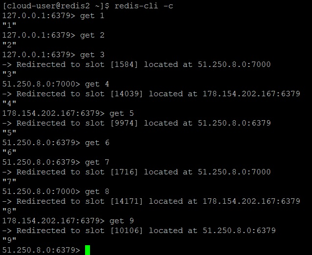

_[Ссылка](https://github.com/netology-code/devkub-homeworks/blob/main/11-microservices-04-scaling.md) на задания_

### Задание 1

> Поддержка контейнеров;

Похоже, речь идет про Kubernetes. Может убравлять разными типами контейнеров

> Обеспечивать обнаружение сервисов и маршрутизацию запросов;

В Kubernetes между контейнерами есть сеть, каждый контейнер может по имени обратиться к другому контейнеру, также есть имена служб. Похоже, при поднятии нового экземпляра сервиса, его адрес автоматически попадет в маршрутизацию по имени службы. 

> Обеспечивать возможность горизонтального масштабирования;

Kubernetes позволяет онлайн поднимать дополнительные экземпляры сервисов

> Обеспечивать возможность автоматического масштабирования;

В лекции говорилось про Kubernetes Horizontal Pod Autoscaler, он будет автоматически поднимать дополнительные экземпляры сервисов при заданных условиях

> Обеспечивать явное разделение ресурсов доступных извне и внутри системы;

Kubernetes позволяет запускать сервисы на разных машинах. Ресурсы, доступные извне можно прибить на одну машину, а остальные на другую

> Обеспечивать возможность конфигурировать приложения с помощью переменных среды, в том числе с возможностью безопасного хранения чувствительных данных таких как пароли, ключи доступа, ключи шифрования и т.п.

При запуске контейнеров (в часности docker), можно передать им информацию из переменных среды.  

---

### Задание 2

Построил кластер Redis на трех нодах c 3 мастерами и 1 репликой. Используемый [playbook](./ansible/site.yml)

Вывод информации из `redis-cli`

Поместим в кеш 9 записей через консоль. Записи раскидались по всем трем нодам

Выключим первую ноду

Проверим информацию о кластере из консоли

Из консоли обратимся ко всем созданным нами ранее ключам

Все значения получены с двух нод, кластер работает.

---