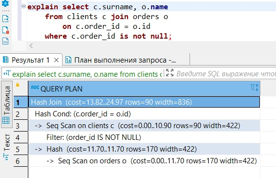

### Задание 1

```yaml
version: "2.2"
services:
  postgres:
    image: postgres:12
    environment:
      POSTGRES_PASSWORD: admin
    ports:
      - "5432:5432"
    volumes:
      - ./data:/data
      - ./backup:/backup
```
---
### Задание 2

- итоговый список БД


- описание таблиц

```commandline
test_db=> \d clients
                                     Table "public.clients"
  Column  |          Type          | Collation | Nullable |               Default
----------+------------------------+-----------+----------+-------------------------------------
 id       | integer                |           | not null | nextval('clients_id_seq'::regclass)
 surname  | character varying(200) |           |          |
 country  | character varying(200) |           |          |
 order_id | integer                |           |          |
Indexes:
    "clients_pkey" PRIMARY KEY, btree (id)
    "clients_country_idx" btree (country)
Foreign-key constraints:
    "cli_ord_id_fk" FOREIGN KEY (order_id) REFERENCES orders(id)

test_db=> \d orders
                                    Table "public.orders"
 Column |          Type          | Collation | Nullable |              Default
--------+------------------------+-----------+----------+------------------------------------
 id     | integer                |           | not null | nextval('orders_id_seq'::regclass)
 name   | character varying(200) |           |          |
 price  | integer                |           |          |
Indexes:
    "orders_pkey" PRIMARY KEY, btree (id)
Referenced by:
    TABLE "clients" CONSTRAINT "cli_ord_id_fk" FOREIGN KEY (order_id) REFERENCES orders(id)
```
- запрос на получение списка пользователей с правами

```sql
select grantee, table_name, privilege_type 
from information_schema.role_table_grants rtg 
where table_catalog = 'test_db';
```

- вывод списка пользователей с правами

```commandline
     grantee      | table_name | privilege_type
------------------+------------+----------------
 test-admin-user  | clients    | INSERT
 test-admin-user  | clients    | SELECT
 test-admin-user  | clients    | UPDATE
 test-admin-user  | clients    | DELETE
 test-admin-user  | clients    | TRUNCATE
 test-admin-user  | clients    | REFERENCES
 test-admin-user  | clients    | TRIGGER
 test-admin-user  | orders     | INSERT
 test-admin-user  | orders     | SELECT
 test-admin-user  | orders     | UPDATE
 test-admin-user  | orders     | DELETE
 test-admin-user  | orders     | TRUNCATE
 test-admin-user  | orders     | REFERENCES
 test-admin-user  | orders     | TRIGGER
 test-simple-user | clients    | INSERT
 test-simple-user | clients    | SELECT
 test-simple-user | clients    | UPDATE
 test-simple-user | clients    | DELETE
 test-simple-user | orders     | INSERT
 test-simple-user | orders     | SELECT
 test-simple-user | orders     | UPDATE
 test-simple-user | orders     | DELETE
(22 rows)
```
---
### Задание 3

Количество записей для таблиц
```commandline
test_db=> select count(1) from clients;
 count
-------
     5
(1 row)

test_db=> select count(*) from orders;
 count
-------
     5
(1 row)
```

---
### Задание 4

запрос на совершение заказов

```
update clients set order_id = (select id from orders where name = 'Книга') where surname ='Иванов Иван Иванович';
update clients set order_id = (select id from orders where name = 'Монитор') where surname ='Петров Петр Петрович';
update clients set order_id = (select id from orders where name = 'Гитара') where surname ='Иоганн Себастьян Бах';
```

вывод заказов

```
test_db=> select c.surname, o.name from clients c join orders o on c.order_id = o.id where c.order_id is not null;		

       surname        |  name
----------------------+---------
 Иванов Иван Иванович | Книга
 Петров Петр Петрович | Монитор
 Иоганн Себастьян Бах | Гитара
(3 rows)

```

---
### Задание 5



Дело было так:  
1. Последовательно читалась таблица orders. Данные начали возвращаться сразу, все данные вернулись за 11.7 единиц времени. Оптимизатор ожидал, что вернется 170 строк, средний размер записей 422 байта
2. На основе выборки из orders составлялась Hash-таблица
3. Последовательно читалась таблица clients и записи фильтровались по order_id. Предполагалось, что выберется 90 записей
4. На основе выборки из clients составилась Hash-таблица
5. Произошло соединение выборок по полученым на 2 и 4 этапе Hash-таблицам

---
### Задание 6

Обновленный docker-compose.yaml
```yaml
version: "2.2"

services:
  postgres:
    image: postgres:12
    environment:
      POSTGRES_PASSWORD: admin
    ports:
      - "5432:5432"
    volumes:
      - data_vol:/data
      - backup_vol:/backup

  postgres_for6:
    image: postgres:12
    environment:
      POSTGRES_PASSWORD: admin2
    ports:
      - "15432:5432"
    volumes:
      - data_vol:/data2
      - backup_vol:/backup2

volumes:
  data_vol:
    driver: local
  backup_vol:
    driver: local
```
Запускаем контейнеры и заполняем первую БД данными из предыдущих заданий
```commandline    
vagrant@vagrant:~/sql-hw$ ./run.sh
[+] Running 5/5
 ⠿ Network sql-hw_default            Created                                                                                                                                            0.1s
 ⠿ Volume "sql-hw_data_vol"          Created                                                                                                                                            0.0s
 ⠿ Volume "sql-hw_backup_vol"        Created                                                                                                                                            0.0s
 ⠿ Container sql-hw-postgres_for6-1  Started                                                                                                                                            0.8s
 ⠿ Container sql-hw-postgres-1       Started                                                                                                                                            0.8s
Password for user postgres:
CREATE DATABASE
CREATE ROLE
Password for user test-admin-user:
CREATE TABLE
...
UPDATE 1
```
Сам процесс создания бекапа и восстановления
```commandline
vagrant@vagrant:~/sql-hw$ docker ps
CONTAINER ID   IMAGE         COMMAND                  CREATED          STATUS          PORTS                                         NAMES
2c1e2ae54104   postgres:12   "docker-entrypoint.s…"   58 seconds ago   Up 56 seconds   0.0.0.0:5432->5432/tcp, :::5432->5432/tcp     sql-hw-postgres-1
35f1ca333133   postgres:12   "docker-entrypoint.s…"   58 seconds ago   Up 56 seconds   0.0.0.0:15432->5432/tcp, :::15432->5432/tcp   sql-hw-postgres_for6-1

vagrant@vagrant:~/sql-hw$ docker exec -ti sql-hw-postgres-1 bash
root@2c1e2ae54104:/# chown -R postgres:postgres /backup
root@2c1e2ae54104:/# su - postgres
postgres@2c1e2ae54104:~$ pg_dump -d test_db > /backup/backup_test_db.sql
postgres@2c1e2ae54104:~$
logout
root@2c1e2ae54104:/#
exit

vagrant@vagrant:~/sql-hw$ docker stop sql-hw-postgres-1
sql-hw-postgres-1

vagrant@vagrant:~/sql-hw$ docker exec -ti sql-hw-postgres_for6-1 bash
root@35f1ca333133:/# su - postgres
postgres@35f1ca333133:~$ createdb test_db
postgres@35f1ca333133:~$ createuser test-admin-user
postgres@35f1ca333133:~$ createuser test-simple-user
postgres@35f1ca333133:~$ psql -U test-admin-user -d test_db -f /backup2/backup_test_db.sql
SET
SET
...
GRANT

postgres@35f1ca333133:~$ psql -U test-admin-user -d test_db
psql (12.10 (Debian 12.10-1.pgdg110+1))
Type "help" for help.

test_db=> select * from clients;
 id |                surname                 | country | order_id
----+----------------------------------------+---------+----------
  4 | Ронни Джеймс Дио         | Russia  |
  5 | Ritchie Blackmore                      | Russia  |
  1 | Иванов Иван Иванович | USA     |        3
  2 | Петров Петр Петрович | Canada  |        4
  3 | Иоганн Себастьян Бах | Japan   |        5
(5 rows)

test_db=>
```
---
