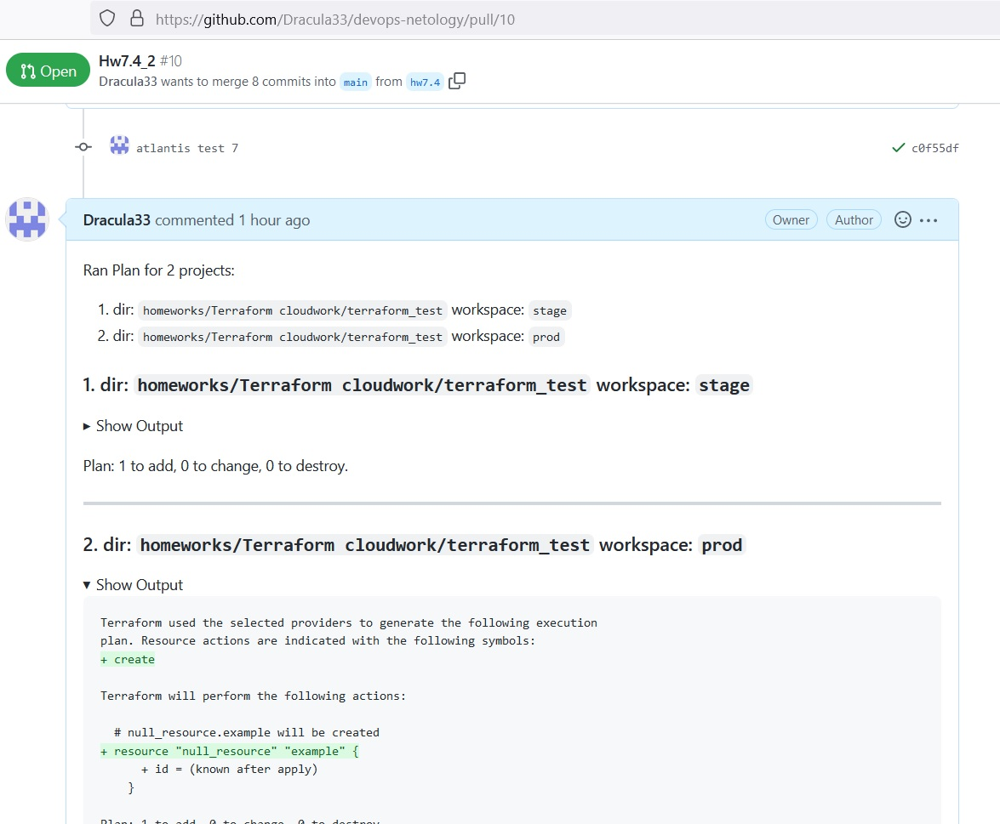
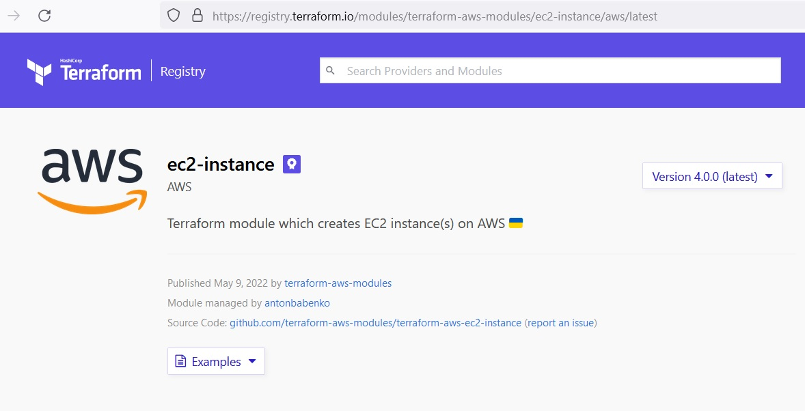
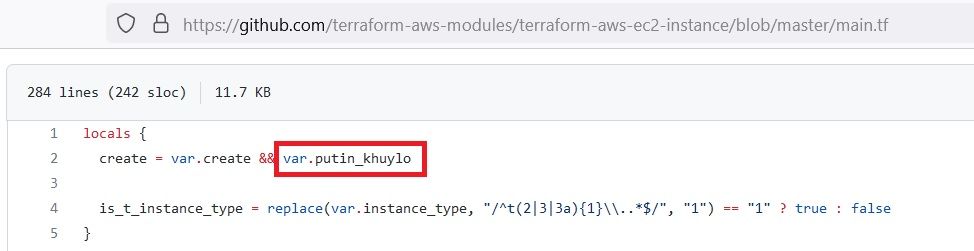
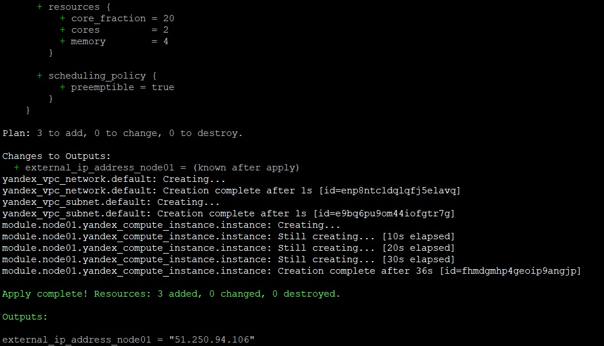

_[ссылка](https://github.com/netology-code/virt-homeworks/tree/master/07-terraform-04-teamwork) на задания_

### Задача 1

Преподаватель сказал, что сейчас Terraform не ходит на наши сервера. Сам не пробовал

---
### Задача 2

1. Серверный конфиг Atlantis ([server.yaml](https://github.com/Dracula33/devops-netology/blob/hw7.4/homeworks/Terraform%20cloudwork/server.yaml))

```yaml
repos:
  - id: /github.com/dracula33/devops-netology/
    allow_custom_workflows: true
    workflow: custom

workflows:
  custom:
    plan:
      steps:
        - run: echo INIT
        - init
        - run: echo PLAN
        - plan:
            extra_args: ["-lock", "false"]
    apply:
      steps:
        - run: echo APPLY
        - apply
```

2. Конфиг уровня репозитория. ([atlantis.yaml](https://github.com/Dracula33/devops-netology/blob/hw7.4/atlantis.yaml))

```yaml
version: 3
projects:
- dir: "/homeworks/Terraform cloudwork/terraform_test"
  workspace: stage
- dir: "/homeworks/Terraform cloudwork/terraform_test"
  workspace: prod

  autoplan:
    when_modified: ["*.tf"]
    enabled: true
```

3. Что в итоге получилось с такими конфигами.  
_[ссылка](https://github.com/Dracula33/devops-netology/pull/10) на Pull-request, где происходило приручение Atlantis_



---

### Задача 3

Разбирал [этот](https://registry.terraform.io/modules/terraform-aws-modules/ec2-instance/aws/latest) модуль.  
  
Использовать бы однозначно не стал.
1. Внутри есть странные переменные)))  

3. В модуле можно задать переменные, для них указано описание и тип данных. Проверок на введенные значения нет, только пустые значения по умолчанию.
4. В модуле сразу есть вывод всей информации о созданном инстансе. Это понравилось
5. При создании инстанса переменные просто подставляются в поля. 

По моему мнению, использование этого модуля не дает каких-то преимуществ по сравнению с просто использованием ресурса напрямую. Значения по умолчанию подставятся и сами.

**Использование модулей в Terraform**

Для выполнения задания сделал Yandex Cloud [модуль](https://github.com/Dracula33/devops-netology/tree/main/homeworks/Terraform%20cloudwork/using_modules/modules/cheep-centos7-instance) по созданию экземпляра `yandex_compute_instance` с минимальными ресурсами.  

Создал инстанс при помощи модуля

```terraform
module "node01" {
  source = "./modules/cheep-centos7-instance"
  subnet_id = "${yandex_vpc_subnet.default.id}"
}

output "external_ip_address_node01" {
  value = "${module.node01.external-ip}"
}
```

Вывод `terraform apply`



---