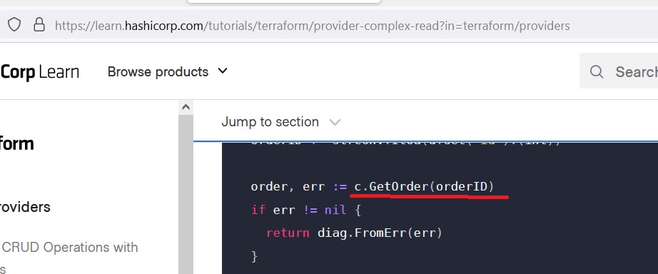

_[ссылка](https://github.com/netology-code/virt-homeworks/tree/master/07-terraform-06-providers) на задания_

### Задача 1

1. Ресурсы и датасорсы

[Датасорсы](https://github.com/hashicorp/terraform-provider-aws/blob/main/internal/provider/provider.go#L425)  

[Ресурсы](https://github.com/hashicorp/terraform-provider-aws/blob/main/internal/provider/provider.go#L916)  

2. aws_sqs_queue
- namе [конфликтует](https://github.com/hashicorp/terraform-provider-aws/blob/main/internal/service/sqs/queue.go#L87) с name_prefix  

- максимальная длина - 80
- регулярное [выражение](https://github.com/hashicorp/terraform-provider-aws/blob/main/internal/service/sqs/queue.go#L427)    

---

### Задача 2

1. Задание сделал не до конца. Прошел [implement create](https://learn.hashicorp.com/tutorials/terraform/provider-create?in=terraform/providers)

В инструкции по созданию [complex read](https://learn.hashicorp.com/tutorials/terraform/provider-complex-read?in=terraform/providers) есть ошибка. Аналогичная есть и дальше в создании ресурса  

В используемом [методе](https://github.com/hashicorp-demoapp/hashicups-client-go/blob/main/orders.go#L33) вторым обязательным параметром должен передаваться токен.  

2. Получившийся на пройденных этапах [исходный код](https://github.com/Dracula33/devops-netology/tree/main/homeworks/Terraform%20own%20providers/hashicups) и [main.tf](https://github.com/Dracula33/devops-netology/blob/main/homeworks/Terraform%20own%20providers/examples/main.tf) используемый для тестов  

3. Результат компиляции

Вывод `terraform apply` по созданию ресурса кофе  

Вывод `docker compose logs` из контейнера с Hashicups  

---