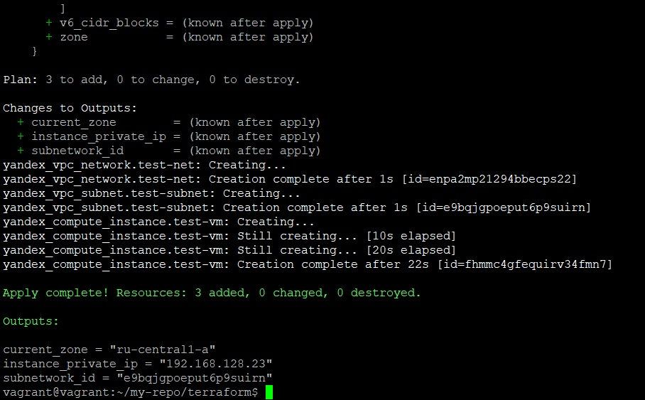

### Задание 1

Чтобы не указывать параметры авторизации в коде, можно воспользоваться переменными окружения
```commandline
vagrant@vagrant:~/terraform$ export YC_TOKEN=Abla**********abla
vagrant@vagrant:~/terraform$ export YC_FOLDER_ID=bla************4
vagrant@vagrant:~/terraform$ export YC_CLOUD_ID=blabla*********r
```

---

### Задание 2

1. Образ для облака можно собрать при помощи Packer
2. [Ссылка](https://github.com/Dracula33/devops-netology/tree/main/terraform) на файлы конфигурации Terraform. Ниже вывод `terraform apply`



---