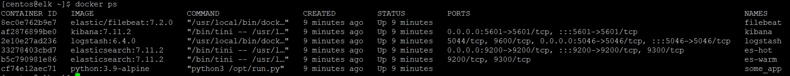
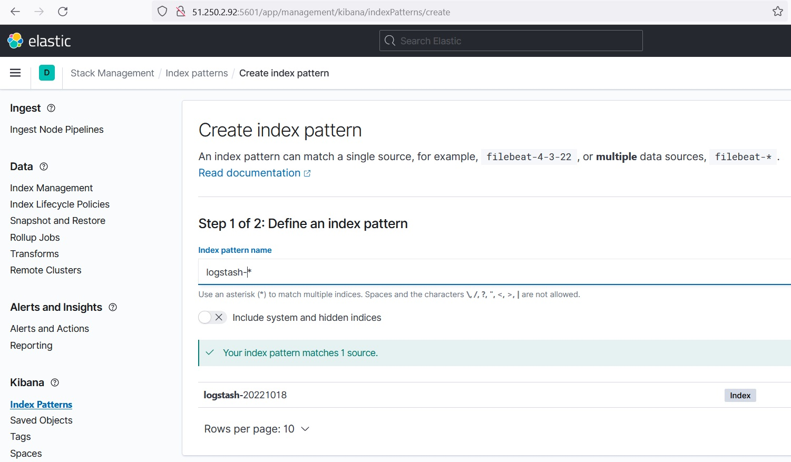
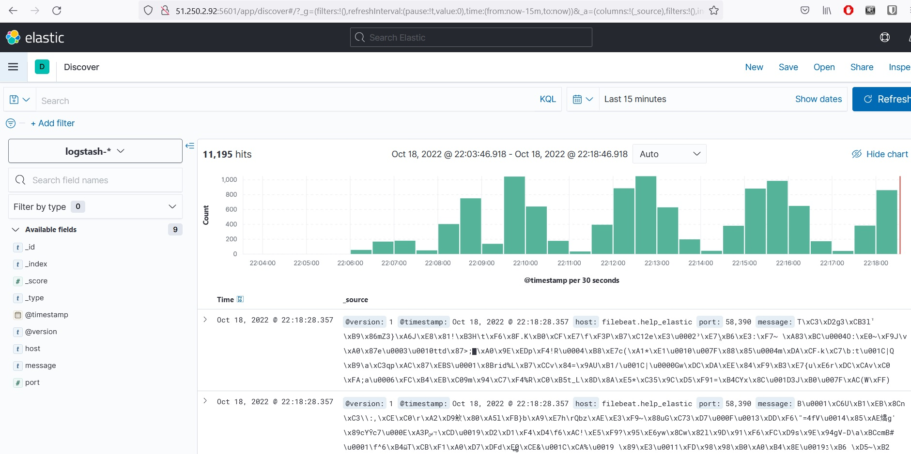

_[Ссылка](https://github.com/netology-code/mnt-homeworks/tree/MNT-13/10-monitoring-04-elk) на задания_

### Задание 1

Использовал директорию help, но все равно пришлось разбираться с конфигурацией filebeat и logstash. Сходу запись в elastic не работала    

Конфигурация запустилась  

Kibana открылась

---

### Задание 2

После перебора некоторых настроек данные начали писаться в elastic. Появилось предложение по созданию индекса   

Поиск по данным работает   

К сожалению, не удалось победить кодировку. Это показалось очень странным, так как в логах везде используется латиница.  
Codec plain с параметром [charset](https://www.elastic.co/guide/en/logstash/current/plugins-codecs-plain.html#plugins-codecs-plain-charset) в настройках logstash не помог. Так же не помогло использование [encoding](https://www.elastic.co/guide/en/beats/filebeat/current/filebeat-input-container.html#_encoding) в input filebeat.

---
