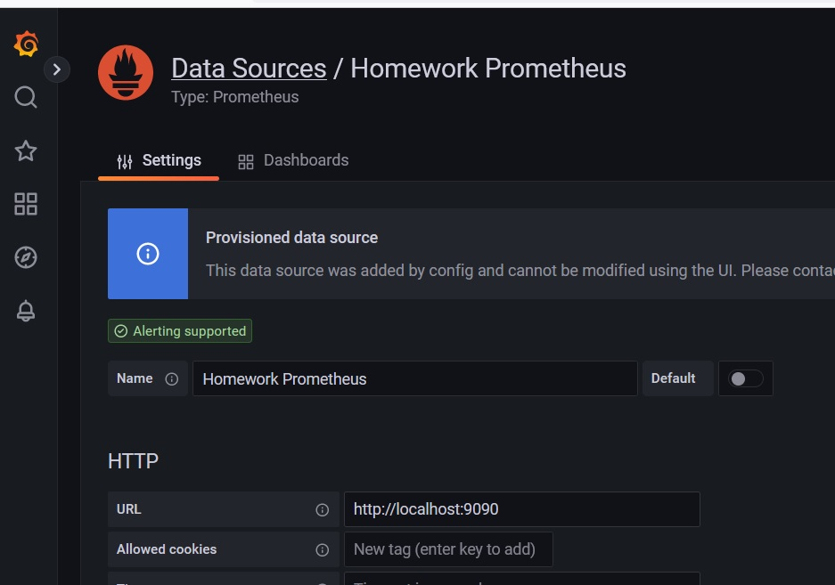
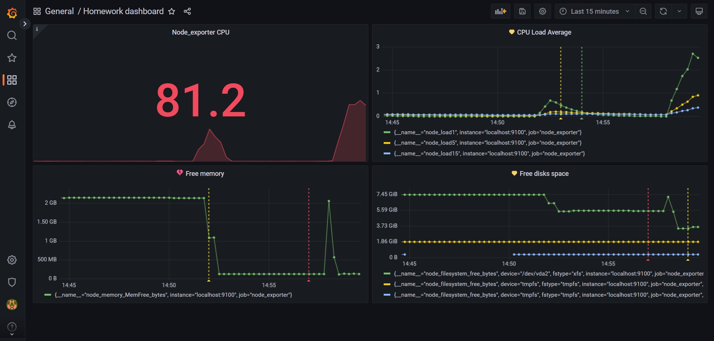
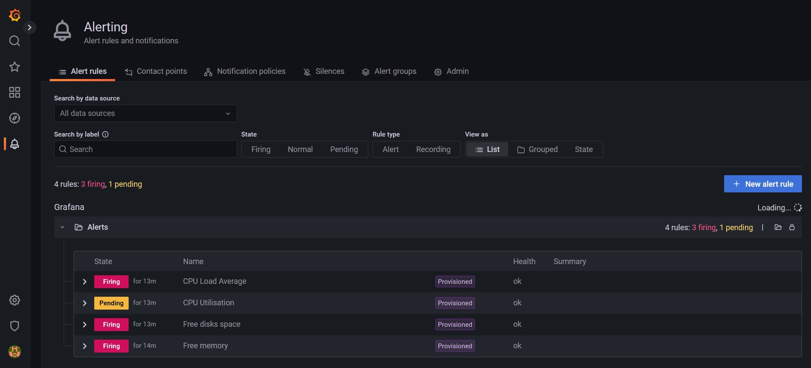
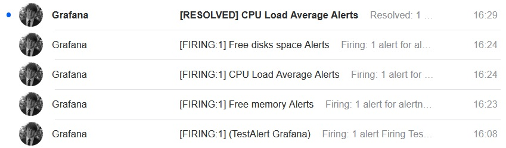
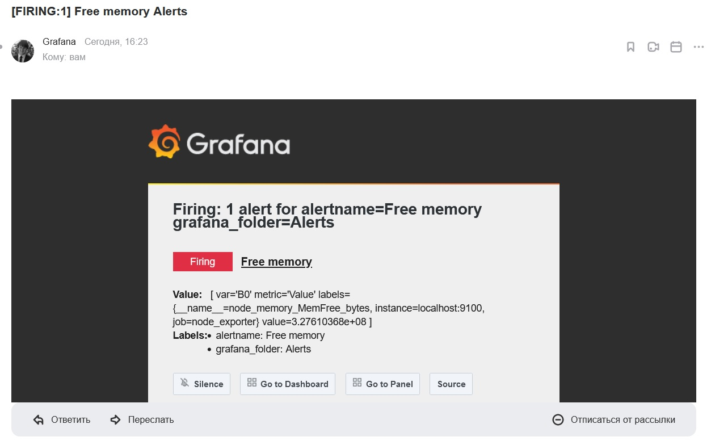

_[Ссылка](https://github.com/netology-code/mnt-homeworks/tree/MNT-13/10-monitoring-03-grafana) на задания_

### Задание 1

Развернул grafana, prometheus, node-exporter при помощи [плейбука](./ansible) Ansible

Сразу добавил в него конфигурационный [файл](./ansible/templates/grafana/provisioning/datasources/prometheus.yaml.j2) для provisioning datasource

Плейбук отработал успешно, Prometheus появился в Data Sources

---

### Задание 2

Создал Dashboard, добавил метрики

PromQL запросы:
1. Node_exporter CPU  
`100 - (avg by(instance) (rate(node_cpu_seconds_total{job="node_exporter", mode="idle"}[1m])) * 100)`
2. CPU Load Average  
`node_load1{job="node_exporter"}`  
`node_load5{job="node_exporter"}`  
`node_load15{job="node_exporter"}`

4. Free memory  
`node_memory_MemFree_bytes{job="node_exporter"}`
5. Free disks space  
`node_filesystem_free_bytes{instance="localhost:9100"}`

---

### Задание 3

Настроил алерты по каждой панели.  
Изменения в Dashboard можно видеть на скрине в пункте 2.  
Здесь приведу скрин со списком алертов

#### Дополнительная информация по provisioning/alerting

[Источник](https://github.com/grafana/grafana/discussions/53490)

1. Настраиваем алерты в интерфейсе графаны
2. Получаем JSON с описанием по ссылке http://IP_GRAFANA:3000/api/ruler/grafana/api/v1/rules/
3. Меняем во второй строчке название корневого элемента (содержит название каталога с алертами) на _groups_
4. Добавляем выше элемент `"apiVersion": 1,`, чтобы он был на одном уровне с _groups_
5. Внутрь каждого элемента в _groups_ на уровне элемента _rules_ добавляем элемент _folder_ с названием каталога для алертов
6. Удаляем из каждого правила объект _grafana_alert_. Все его содержимое поднимаем на его уровень
7. У элементов _rules.data.relativeTimeRange_, которые не являются _condition_, проверить значения _from_ и _to_. Они не должны быть одинаковые (к примеру оба 0)

---

### Задание 4

Сохраненная в [json](./ansible/templates/grafana/provisioning/dashboards/homework_dashboard.json) Dashboard

---

### Дополнительное задание

1. В grafana.ini указал параметры подключения к smtp серверу
2. Для алертов настроил Contact point, указал почту

Через `dd` создал несколько больших файлов на сервере. Получил простенькое уведомление

---