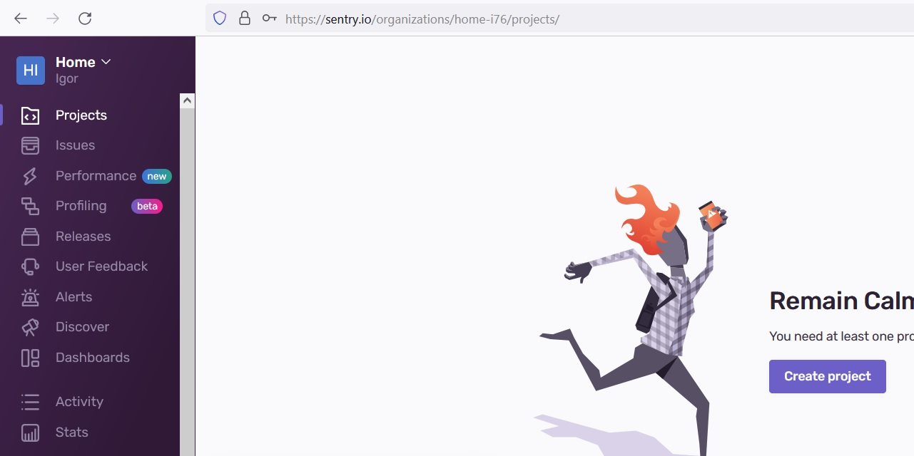
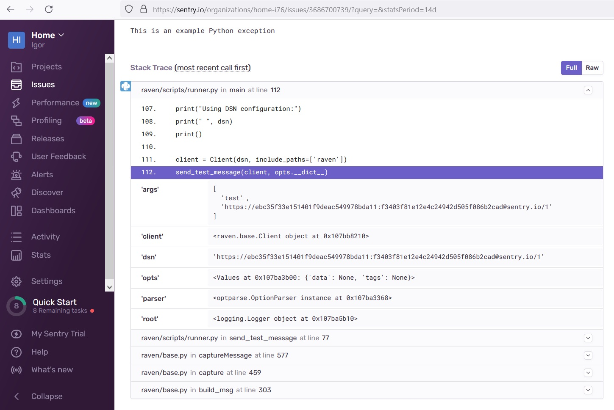
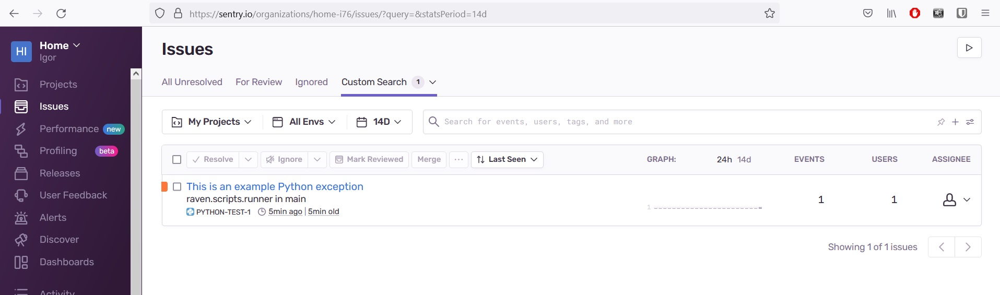
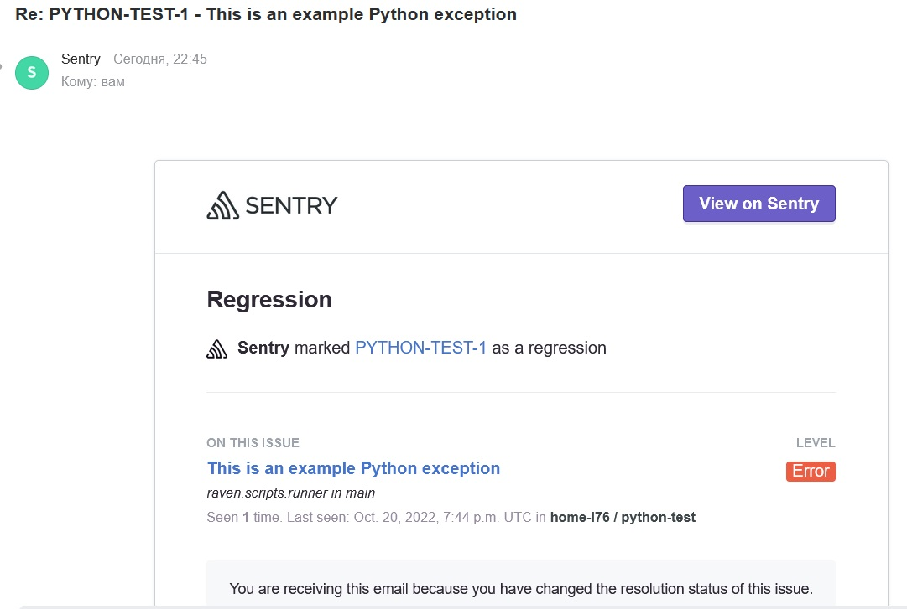
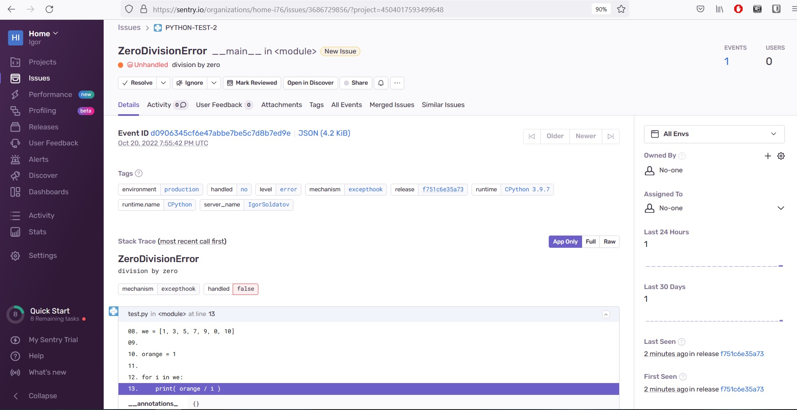
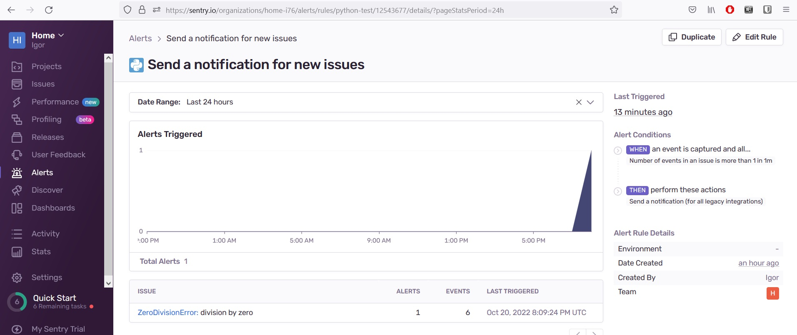

_[Ссылка](https://github.com/netology-code/mnt-homeworks/tree/MNT-13/10-monitoring-05-sentry) на задания_

### Задание 1

Зарегистрировался в Sentry



---

### Задание 2

Создал проект, сгенерировал тестовое событие



Пометил его *Resolved*. Отобразил весь список событий



---

### Задание 3

Настроил правило оповещения, если будет 1 ошибка в минуту.
Получил оповещение. Правда похоже, что это оповещение о закрытии задачи  



---

### Задание 4

Сделал тестовое приложение

```python
import sentry_sdk

sentry_sdk.init(
    dsn="https://***************************.ingest.sentry.io/**************",
    traces_sample_rate=1.0
)

we = [1, 3, 5, 7, 9, 0, 10]

orange = 1

for i in we:
    print( orange / i )
```
Получил ошибку
```commandline
$./mon-sentry/test.py
1.0
0.3333333333333333
0.2
0.14285714285714285
0.1111111111111111
Traceback (most recent call last):
  File "C:\Users\dracu\Documents\devops16\homeworks\mon-sentry\test.py", line 13, in <module>
    print( orange / i )
ZeroDivisionError: division by zero
Sentry is attempting to send 2 pending error messages
Waiting up to 2 seconds
Press Ctrl-Break to quit
```
В Sentry создалось Issue



В алертах тоже появилась информация об отправке нотификаций  



---