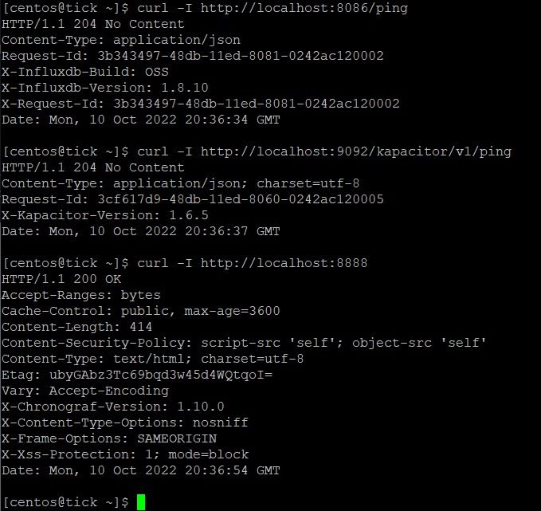
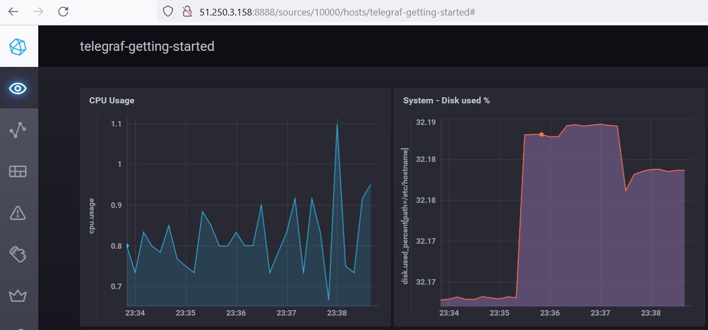
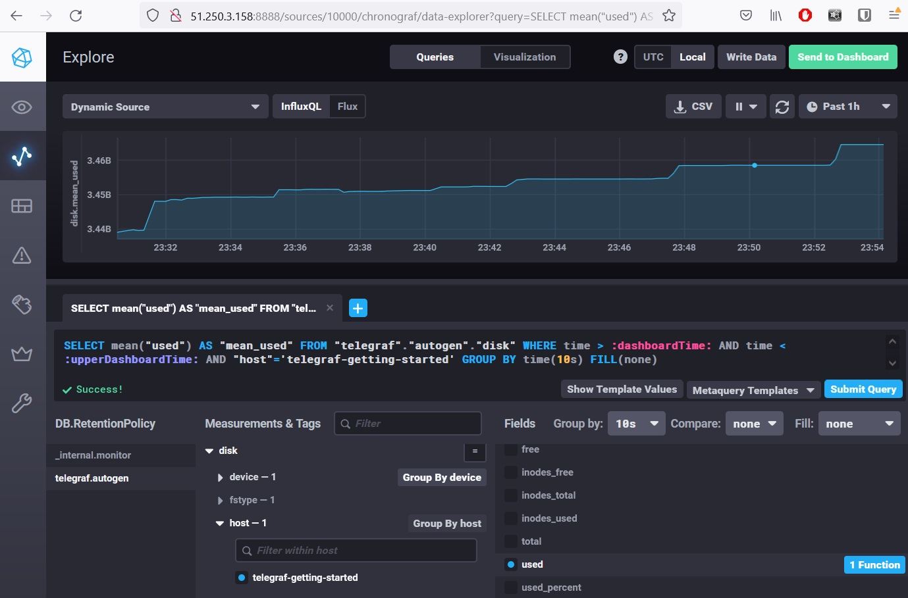
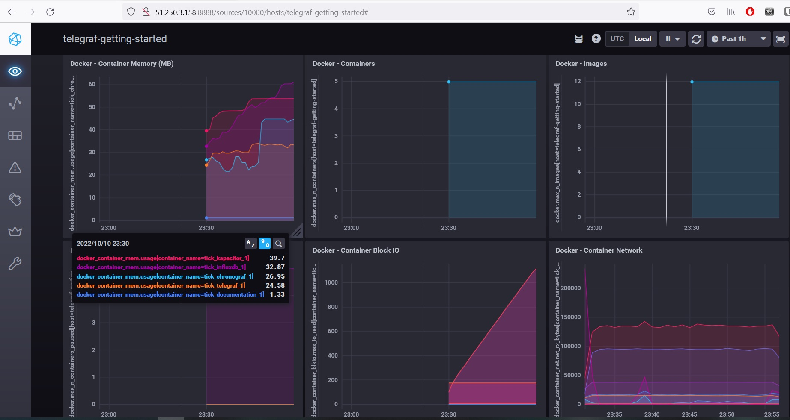
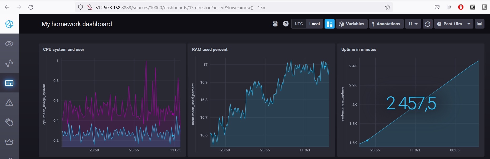

_[Ссылка](https://github.com/netology-code/mnt-homeworks/tree/MNT-13/10-monitoring-02-systems) на задания_

### Задание 1

**Push модель**  
1. Проще настраивается. На всех агентах может быть одинаковая конфигурация с одним адресом сервера мониторинга. Раскатал агент и данные пошли  
2. Может работать быстрее за счет использования UDP в качестве транспорта  
3. За счет UDP данные могут теряться

**Pull модель**
1. Данные приходят в известное время, когда сервер их запрашивает
2. Проще отлаживать. Используется HTTP, запрос данных можно сделать через `curl`
3. Сложнее добавлять новые сервера в конфигурацию. На сервере мониторинга нужно не забыть добавить URL нового агента для получения данных  

---

### Задание 2

Системы мониторинга с Pull моделью
- Prometheus
- Nagios

Системы мониторинга с Push моделью
- TICK

Системы мониторинга, поддерживающие обе модели
- Zabbix
- VictoriaMetrics

---

### Задание 3

Результат `curl`

Интерфейс Chronograf

---

### Задание 4

График утилизации диска

---

### Задание 5

Метрики docker

---

### Дополнительное задание

Тестовый dashboard

---