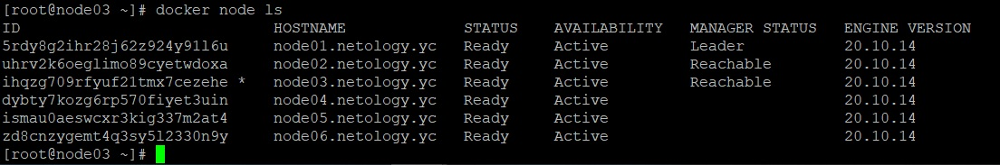
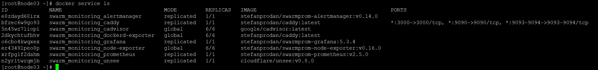

### Задача 1
1. 
   * в режиме replication кластер запускает указанное число реплик на всем пуле нод кластера. В зависимости от загруженности конкретной ноды кластер сам решает, стоит ли на ней запустить реплику.
   * в режиме global экземпляр сервиса запускается на каждой из нод

2. В кластере используется алгоритм Distributed Consensus через протокол Raft 

3. Overlay network - сеть, построенная на базе другой сети.  
Через базовую сеть (пусть интернет) можно подключиться к VPN шлюзу, который предоставит доступ в другую сеть, недоступную из интернета, но трафик в которую, будет ходить по нему 
---
### Задача 2

---
### Задача 3

---
### Задача 4
`docker swarm update --autolock=true`  
Команда блокирует автозапуск manager нод в кластере после их перезапуска. Manager не запустится до тех пор, пока не будет введен код разблокировки.  
При запуске manager нода получает в память ключ для обмена информацией между manager-нодами и ключ для доступа к логам Raft.  
Похоже, блокировка используется для того, чтобы при запуске manager-ноды эти ключи не утекли к злоумышленнику.

---
