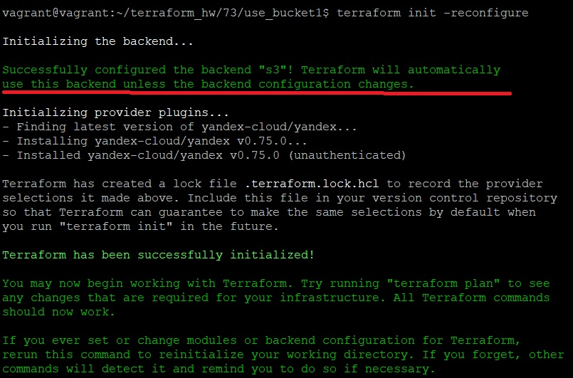
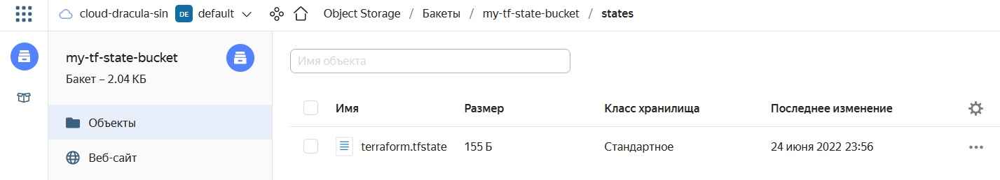
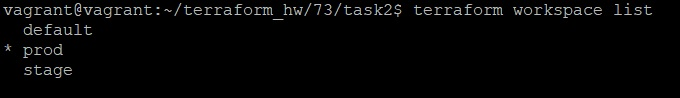
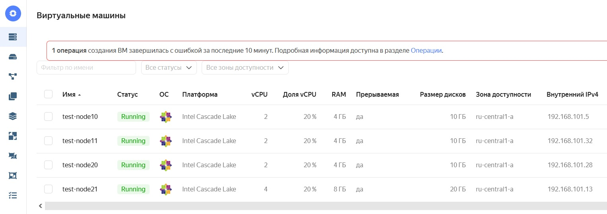

_[ссылка](https://github.com/netology-code/virt-homeworks/tree/virt-11/07-terraform-03-basic) на задания_

### Задача 1

1. Создаем bucket в одном проекте

```terraform
#Backet для хранения состояний
resource "yandex_storage_bucket" "tf-state-bucket" {
  access_key = "${var.static_access_key}"
  secret_key = "${var.static_access_key_secret}"
  bucket = "my-tf-state-bucket"
  max_size = 1073741824
  default_storage_class = "STANDARD"
}
```

2. Подключаем бакет в другом проекте

```terraform
# Provider
terraform {
  required_providers {
    yandex = {
      source = "yandex-cloud/yandex"
    }
  }

  backend "s3" {
    endpoint   = "storage.yandexcloud.net"
    bucket     = "my-tf-state-bucket"
    region     = "ru-central1"
    key        = "states/terraform.tfstate"
    access_key = "A*******************K"
    secret_key = "S*******************************K"

    skip_region_validation      = true
    skip_credentials_validation = true
  }
}
```

3. Инициализируем конфигурацию, получаем сообщение об использовании backend



4. Проверяем состояние bucket в консоли яндекса. Видит, что появился файл состояний



---

### Задача 2

1. Вывод списка workspace



2. Конфигурация инстансов на основе workspace

_locals.tf_
```terraform
locals {

  instance_platform_id = {
    stage = "standard-v3"
    prod = "standard-v2"
  }

  instance_count = {
    stage = 1
    prod = 2
  }

  #для создания через for_each
  instances = {
    #название = [номер ноды, число ядер, размер памяти, размер диска]
    "test-node20" = ["1","2","4","10"],
    "test-node21" = ["2","4","8","20"]
  }

}
```

_test_node1.tf - инстансы на основе count_
```terraform
resource "yandex_compute_instance" "test-node1" {

  count = local.instance_count[terraform.workspace]

  name                      = "test-node1${count.index}"
  description               = "Тестовая нода 1"
  zone                      = "ru-central1-a"
  hostname                  = "test_node1${count.index}.netology.yc"
  allow_stopping_for_update = true

  platform_id = local.instance_platform_id[terraform.workspace]

  scheduling_policy {
    preemptible = true
  }

  resources {
    cores  = 2
    memory = 4
    core_fraction = 20
  }

  boot_disk {
    initialize_params {
      image_id    = "${yandex_compute_image.default.id}"
      size = "10"
    }
  }

  network_interface {
    subnet_id  = "${yandex_vpc_subnet.default.id}"
    nat        = true
  }

  metadata = {
    ssh-keys = "centos:${file("~/.ssh/id_rsa.pub")}"
  }
}

```

_test_node2.tf - инстансы на основе for_each_
```terraform
resource "yandex_compute_instance" "test-node2" {

  for_each = local.instances

  name                      = each.key
  description               = "Тестовая нода 2"
  zone                      = "ru-central1-a"
  hostname                  = "test_node2${each.value[0]}.netology.yc"
  allow_stopping_for_update = true

  platform_id = local.instance_platform_id[terraform.workspace]

  scheduling_policy {
    preemptible = true
  }

  resources {
    cores  = each.value[1]
    memory = each.value[2]
    core_fraction = 20
  }

  boot_disk {
    initialize_params {
      image_id    = "${yandex_compute_image.default.id}"
      size = each.value[3]
    }
  }
  
  lifecycle {
    create_before_destroy = "true"
  }

  network_interface {
    subnet_id  = "${yandex_vpc_subnet.default.id}"
    nat        = true
  }

  metadata = {
    ssh-keys = "centos:${file("~/.ssh/id_rsa.pub")}"
  }
}
```

3. Параметр `lifecycle` добавил для инстансов, создающихся через for_each.  
Из задания показалось, что его нужно было добавить только для первого из двух создающихся, но параметризировать это не вышло.
В [документации](https://www.terraform.io/language/meta-arguments/lifecycle#literal-values-only) терраформа сказано, что в этом блоке разрешено использовать только статичные значения.


4. Что получилось при деплое для workspace prod



5. Вывод информации об инстансах из `terraform plan` для workspace prod
```terraform
  # yandex_compute_instance.test-node1[0] will be created
  + resource "yandex_compute_instance" "test-node1" {
      + allow_stopping_for_update = true
      + created_at                = (known after apply)
      + description               = "Тестовая нода 1"
      + folder_id                 = (known after apply)
      + fqdn                      = (known after apply)
      + hostname                  = "test_node10.netology.yc"
      + id                        = (known after apply)
      + metadata                  = {
          + "ssh-keys" = <<-EOT
                centos:ssh-rsa AA...= vagrant@vagrant
            EOT
        }
      + name                      = "test-node10"
      + network_acceleration_type = "standard"
      + platform_id               = "standard-v2"
      + service_account_id        = (known after apply)
      + status                    = (known after apply)
      + zone                      = "ru-central1-a"

      + boot_disk {
          + auto_delete = true
          + device_name = (known after apply)
          + disk_id     = (known after apply)
          + mode        = (known after apply)

          + initialize_params {
              + block_size  = (known after apply)
              + description = (known after apply)
              + image_id    = (known after apply)
              + name        = (known after apply)
              + size        = 10
              + snapshot_id = (known after apply)
              + type        = "network-hdd"
            }
        }

      + network_interface {
          + index              = (known after apply)
          + ip_address         = (known after apply)
          + ipv4               = true
          + ipv6               = (known after apply)
          + ipv6_address       = (known after apply)
          + mac_address        = (known after apply)
          + nat                = true
          + nat_ip_address     = (known after apply)
          + nat_ip_version     = (known after apply)
          + security_group_ids = (known after apply)
          + subnet_id          = (known after apply)
        }

      + placement_policy {
          + host_affinity_rules = (known after apply)
          + placement_group_id  = (known after apply)
        }

      + resources {
          + core_fraction = 20
          + cores         = 2
          + memory        = 4
        }

      + scheduling_policy {
          + preemptible = true
        }
    }

  # yandex_compute_instance.test-node1[1] will be created
  + resource "yandex_compute_instance" "test-node1" {
      + allow_stopping_for_update = true
      + created_at                = (known after apply)
      + description               = "Тестовая нода 1"
      + folder_id                 = (known after apply)
      + fqdn                      = (known after apply)
      + hostname                  = "test_node11.netology.yc"
      + id                        = (known after apply)
      + metadata                  = {
          + "ssh-keys" = <<-EOT
                centos:ssh-rsa AAA...yM= vagrant@vagrant
            EOT
        }
      + name                      = "test-node11"
      + network_acceleration_type = "standard"
	        + platform_id               = "standard-v2"
      + service_account_id        = (known after apply)
      + status                    = (known after apply)
      + zone                      = "ru-central1-a"

      + boot_disk {
          + auto_delete = true
          + device_name = (known after apply)
          + disk_id     = (known after apply)
          + mode        = (known after apply)

          + initialize_params {
              + block_size  = (known after apply)
              + description = (known after apply)
              + image_id    = (known after apply)
              + name        = (known after apply)
              + size        = 10
              + snapshot_id = (known after apply)
              + type        = "network-hdd"
            }
        }

      + network_interface {
          + index              = (known after apply)
          + ip_address         = (known after apply)
          + ipv4               = true
          + ipv6               = (known after apply)
          + ipv6_address       = (known after apply)
          + mac_address        = (known after apply)
          + nat                = true
          + nat_ip_address     = (known after apply)
          + nat_ip_version     = (known after apply)
          + security_group_ids = (known after apply)
          + subnet_id          = (known after apply)
        }

      + placement_policy {
          + host_affinity_rules = (known after apply)
          + placement_group_id  = (known after apply)
        }

      + resources {
          + core_fraction = 20
          + cores         = 2
          + memory        = 4
        }

      + scheduling_policy {
          + preemptible = true
        }
    }

  # yandex_compute_instance.test-node2["test-node20"] will be created
  + resource "yandex_compute_instance" "test-node2" {
      + allow_stopping_for_update = true
      + created_at                = (known after apply)
      + description               = "Тестовая нода 2"
      + folder_id                 = (known after apply)
      + fqdn                      = (known after apply)
      + hostname                  = "test_node21.netology.yc"
      + id                        = (known after apply)
      + metadata                  = {
          + "ssh-keys" = <<-EOT
                centos:ssh-rsa AAA...M= vagrant@vagrant
            EOT
        }
      + name                      = "test-node20"
      + network_acceleration_type = "standard"
      + platform_id               = "standard-v2"
      + service_account_id        = (known after apply)
      + status                    = (known after apply)
      + zone                      = "ru-central1-a"

      + boot_disk {
          + auto_delete = true
          + device_name = (known after apply)
          + disk_id     = (known after apply)
          + mode        = (known after apply)

          + initialize_params {
              + block_size  = (known after apply)
              + description = (known after apply)
              + image_id    = (known after apply)
              + name        = (known after apply)
              + size        = 10
              + snapshot_id = (known after apply)
              + type        = "network-hdd"
            }
        }

      + network_interface {
          + index              = (known after apply)
          + ip_address         = (known after apply)
          + ipv4               = true
          + ipv6               = (known after apply)
          + ipv6_address       = (known after apply)
          + mac_address        = (known after apply)
          + nat                = true
          + nat_ip_address     = (known after apply)
          + nat_ip_version     = (known after apply)
          + security_group_ids = (known after apply)
          + subnet_id          = (known after apply)
        }

      + placement_policy {
          + host_affinity_rules = (known after apply)
          + placement_group_id  = (known after apply)
        }

      + resources {
          + core_fraction = 20
          + cores         = 2
          + memory        = 4
        }

      + scheduling_policy {
          + preemptible = true
        }
    }

  # yandex_compute_instance.test-node2["test-node21"] will be created
  + resource "yandex_compute_instance" "test-node2" {
      + allow_stopping_for_update = true
      + created_at                = (known after apply)
      + description               = "Тестовая нода 2"
      + folder_id                 = (known after apply)
      + fqdn                      = (known after apply)
      + hostname                  = "test_node22.netology.yc"
      + id                        = (known after apply)
      + metadata                  = {
          + "ssh-keys" = <<-EOT
                centos:ssh-rsa AAA...yM= vagrant@vagrant
            EOT
        }
      + name                      = "test-node21"
      + network_acceleration_type = "standard"
      + platform_id               = "standard-v2"
      + service_account_id        = (known after apply)
      + status                    = (known after apply)
      + zone                      = "ru-central1-a"

      + boot_disk {
          + auto_delete = true
          + device_name = (known after apply)
          + disk_id     = (known after apply)
          + mode        = (known after apply)

          + initialize_params {
              + block_size  = (known after apply)
              + description = (known after apply)
              + image_id    = (known after apply)
              + name        = (known after apply)
              + size        = 20
              + snapshot_id = (known after apply)
              + type        = "network-hdd"
            }
        }

      + network_interface {
          + index              = (known after apply)
          + ip_address         = (known after apply)
          + ipv4               = true
          + ipv6               = (known after apply)
          + ipv6_address       = (known after apply)
          + mac_address        = (known after apply)
          + nat                = true
          + nat_ip_address     = (known after apply)
          + nat_ip_version     = (known after apply)
          + security_group_ids = (known after apply)
          + subnet_id          = (known after apply)
        }

      + placement_policy {
          + host_affinity_rules = (known after apply)
          + placement_group_id  = (known after apply)
        }

      + resources {
          + core_fraction = 20
          + cores         = 4
          + memory        = 8
        }

      + scheduling_policy {
          + preemptible = true
        }
    }

  # yandex_vpc_network.default will be created
  + resource "yandex_vpc_network" "default" {
      + created_at                = (known after apply)
      + default_security_group_id = (known after apply)
      + folder_id                 = (known after apply)
      + id                        = (known after apply)
      + labels                    = (known after apply)
      + name                      = "net"
      + subnet_ids                = (known after apply)
    }

  # yandex_vpc_subnet.default will be created
  + resource "yandex_vpc_subnet" "default" {
      + created_at     = (known after apply)
      + folder_id      = (known after apply)
      + id             = (known after apply)
      + labels         = (known after apply)
      + name           = "subnet"
      + network_id     = (known after apply)
      + v4_cidr_blocks = [
          + "192.168.101.0/24",
        ]
      + v6_cidr_blocks = (known after apply)
      + zone           = "ru-central1-a"
    }

```

---